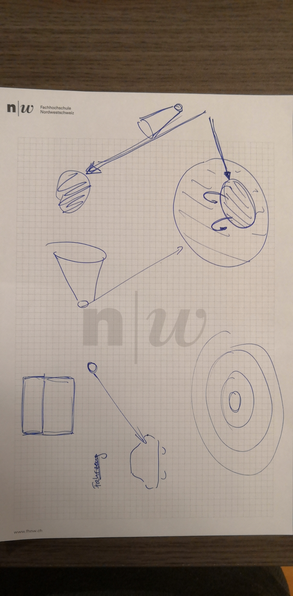

===== Interview Problestellung Dozent

Besondere Schwierigkeiten für Studierende:

* Objekt behält Eigenschaft (Infos sind nicht verloren), wenn Oberklasse zugewiesen
* Methoden nicht mehr aufrufbar, wenn Oberklasse zugewiesen
* Bei überschriebenen Methoden wird die Methode genommen, die zum Objekt passt.

Konzepte Vererbung

* Subklasse ist eine Spezialisierung, Umfang Funktionalität grösser
* Referenz bestimmt die Sicht (Metapher Pfeil, Brille, Fernrohr)

*Interview Notizen*
*Wo kommt das Problem her? Wo liegen die Schwierigkeiten bei den Studenten mit Vererbung?*

* Ein Objekt kann mehrere Hüte aufsetzen
* Wie kann man vermitteln, dass ein Objekt die Eigenschaften behält, wenn ein Typ der Oberklasse zugewiesen wird?
* Warum kann man Objekt dynamisch wechseln?
* Warum bleibt Objekt ein Objekt?
* Wie kann man Referenzen, die eingeschränkt sind, den Studierenden klar machen? Warum kann man die Methoden nicht mehr aufrufen? Es ist doch immer noch ein Programmierer.
"Pogrammier.programmier OK, Statist.programmier NOK" "Person. programmier" NOK
Studierende verstehen nicht:
1) Man kann in einem Obejct o alles speichern. Aber o.getName geht nicht.
2) Wenn man Object auf Person castet, geht o.getName. Studenten denken darunterliegende Infos sind verloren.
Wenn man in der Vererbungsstruktur oben ist, wieso sind die Methoden unterer Objekte immer noch da?
* Häufig vergessen: Wenn man eine Methoden überschrieben hat wird die Methode genommen, die zum Objekt passt, nicht die der Referenz.
* Wenn man ein Objekt erstellt hat, ist es da und existiert und man kann damit arbeiten.

*Haben Sie Vorstellungen in Bezug auf Vererbung?*

* Man sieht ein Velo und ein Auto. Fahrzeug ist eine Garage --> Man kann ein Velo oder ein Auto in die Garage stellen. Man kann beide Unteren Klassen reinsetzen. 
Stuhl/oder besser Mensch? : mit Student, Dozent
Regal mit Items: Apfel, Brot
* Dualität. Bilder, die man sieht?
* Fahrzeug f1 = new Auto(); Was sieht man als Objekt? --> Anderes Bild: Webshop. Evtl. auch als Datenbank vorstellen: Verschiedene Tabellen mit einer ID vorstellen.
* Fahrzeug ist der Kern. Auto ist die Erweiterung. Man geht vom kleinen (Fahrzeug) ins Grosse, Erweiterte (Auto). Widerspruch Von Aussen sieht man (kleinere, grobere) das Fahrzeug und nicht das Auto.
* Subklasse ist eine Spezialisierung, trotzdem wird der Umfang und die Fähigkeiten grösser.
Referenz ist ein Punkt mit Pfeil auf Objekt
Der Pfeil ist flexibel, kann ändern (casting)
 
* Gegensatz: Wird grösser trotzdem Spezialisierung
* Metapher: Brille Farbfilter: Rotfilter filtert Farbe heraus, die anderen sind jedoch immer noch da
* Visualisierung soll allgemeingültig sein (Nicht konkret mit Auto oder Fahrzeugbilder): Evtl. auch 3D

