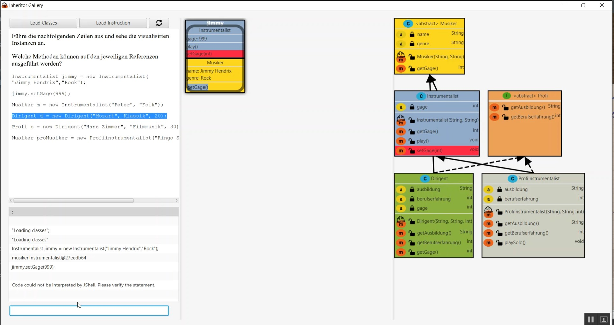

===== Usablity Test Beta

*Test Objekt*

.FindingsProaband1
|====
| Typ Idee, Problem, Lob | Beobachtung | Handlungsempfehlung

|Lob
|1:55, übersichtlich
|

|Lob
|2:43, Farben ansprechend
|

|Problem
|3:22, Pfeile nicht schön, Spitze nicht klar sichtbar. Pfeil hinten durch nicht klar.
|Pfeilspitzen im Vordergrund zeichnen. Linien um Klasse herum führen, statt darunter.

|Problem
|5:04, Code Schrift schlecht lesbar
|Code Schrift anpassen.

|Problem
|5:55, nicht klar, dass unten Links ein Eingabefeld vorhanden ist. Zu wenig prominent.
|Eingabefeld prominenter gestalten, allenfalls grösser.

|Lob
|7:55, Instanz übersichtlich gestaltet
|

|Lob
|8:30, Fabrzusammenhang wird klar.
|

|Problem
|10:33 Referenz Rahmen wenig ansprechend
|Referenz Rahmen ansprechender gestalten.

|====

.FindingsProaband2
|====
| Typ Idee, Problem, Lob | Beobachtung | Handlungsempfehlung

|
|
|

|
|
|

|
|
|

|
|
|

|
|
|

|
|
|

|
|
|

|
|
|

|
|
|

|
|
|

|====
