= InheritorGallery
:toc: macro
:toc-title:
:toclevels: 4

*InheritorGallery*

*IP5 Projektbericht*

Verfasser: Dimitri Muralt, Christoph Wenk

Studiengang: iCompetence

Betreuer und Auftraggeber: Barbara Scheuner, Dieter Holz

Windisch, 13. August 2019

// Path to the code references
:sourcedir: ../inheritorgallery-core/src/main/java
:sourcedirdemo: ../inheritorgallery-demo/src/main/java/inheritorgallery

== Zusammenfassung

*Problemstellung*

Dieser Bericht beschreibt die Analyse und Entstehung einer Applikation im Bereich der objektorientierten Programmierung mit Java, die eine für Programmieranfänger geeignete Darstellung einer Instanz bieten soll. So soll beispielsweise im Falle von Vererbung klar werden, aus welchen Klassen diese Instanz besteht. Bisher bekannte Darstellungen wie UML sind für die Darstellung einer Instanz unzureichend. Auftraggeber sind zwei Dozierende an der FHNW in Brugg. Die Applikation soll mit JavaFX umgesetzt werden und im Unterricht eingesetzt werden können.

*Vorgehen*

In dieser Arbeit werden bestehende Ansätze und Lösungen evaluiert. Dies schliesst sowohl die vorhandenen Darstellungen einer Instanz dar wie auch die Technologien  ein, die eine Analyse eines laufenden Java Programms ermöglichen. Weiter werden eigene Darstellungen einer Instanz entwickelt und deren Qualität in Usability Tests geprüft und weiterentwickelt. Gemäss der erstellten Visualisierung wird eine JavaFX Applikation entwickelt. Der Entwicklungsstand wird in GitHub dokumentiert, sowohl die Applikation wie auch die Evaluation.

*Hauptergebnisse*

Aufgrund der Analyse der vorhandenen Darstellungen und Tools für Programmieranfänger lässt sich festhalten, dass keine Lösungen gefunden wurden, um Instanzen eines Java Programms visuell verständlich darzustellen. Weiter konnten geeignete Visualisierungen von Instanzen entworfen und getestet werden. Das Hauptergebnis dieser Arbeit stellt die erstellte JavaFX Applikation dar, welche gemäss den entworfenen Visualisierungen entwickelt wurde. Um Java Programme zur Laufzeit darstellen zu können wurde JShell eingesetzt. So können externe Programme in Form von JAR Dateien importiert werden. Daraus wird ein UML generiert und dargestellt. Die Applikation verfügt über eine Konsole, in der Java Code eingegeben werden kann. Bei Erstellung von Instanzen werden diese visualisiert, so dass klar wird aus welchen Ursprungs Klassen die Instant bei Vererbung besteht und welche Methoden auf jeweiligen Referenzen aufrufbar sind. Die Instanzen können zudem weiter zur Laufzeit modifiziert werden und auch diese Änderungen werden sichtbar. Zur Analyse von Java Code zur Laufzeit wurde Java Reflection verwendet.

== Inhalt

toc::[]

== Einleitung

Dieser Bericht beschreibt die Analyse und Entstehung der Applikation mit dem Namen InheritorGallery. Zielgruppe
dieser Applikation sind Programmieranfänger im Bereich der objektorientierten Programmierung mit Java.

Die InheritorGallery soll eine für Programmieranfänger geeignete Darstellung einer Instanz bieten. So soll
beispielsweise im Falle von Vererbung klar werden, aus welchen Klassen diese Instanz besteht. Bisher bekannte
Darstellungen wie UML sind für die Darstellung einer Instanz unzureichend. Die gesamte Problemstellung ist im
Kapitel Problemstellung zu finden.

In dieser Arbeit sollen bereits vorhandene Darstellungen einer Instanz ausgewertet werden. Weiter werden eigene
Visualisierungen entworfen und mir Studierenden getestet. Schliesslich soll eine Applikation mit JavaFX umgesetzt werden,
welche eine Visualisierung der Instanzen ermöglicht. Die detaillierte Projektvereinbarung ist im Anhang zu finden.
Die Applikation soll keinen Debugger ersetzen, sondern die relevanten Informationen im Bereich der objektorientierten
Vererbung darstellen.

Der Hauptteil des Berichts ist nicht zwingend chronologisch geordnet sondern sind in
Themenbereiche gruppiert. Nachdem das Kapitel Problemstellung die zu lösende Aufgabe
aufzeigt, sind im Kapitel Analyse die bereits vorhandenen und eingesetzten Technologien
beschrieben. Weiter wird im Kapitel Design und Usability Testing die Entstehung und das
Testen der Prototypen erklärt und schliesslich wird im Kapitel Implementation die
technische Umsetzung geschildert.

Im Kapitel Ergebnisse werden die Resultate und Erreichung der
Projektvereinbarung diskutiert. Das Schlusswort stellt eine Reflexion über der Arbeitsprozess dar. Wesentlicher
Bestandteil ist zudem die erstellte JavaFX Applikation, die unter
// Todo: Applikation referenzieren
zu finden ist.

== Problemstellung

Dieser Abschnitt beschreibt die Aufgabenstellung und wurde übernommen aus dem Projektauftrag übernommen.

https://github.com/FHNW-IP5-IP6/InheritorGallery/tree/doc/docs/anhang/IMVS21inheritorGallery.pdf

*Ausgangslage*

Das Klassendiagramm von UML stellt die Vererbungsbeziehungen zwischen Klassen und Interfaces dar. Dabei werden die Klassen mit ihren Attributen und Methoden als einzelne Quadrate gezeigt. Für die resultierenden Instanzen einer abgeleiteten Klasse ist diese Darstellung irreführend. Für das Verständnis was eine Instanz ausmacht wäre es für einen Programmieranfänger deutlich einfacher wenn die Instanz als eine Einheit visualisiert wird und nicht in mehreren Blöcken.

Eine für Programmieranfänger geeignete Visualisierung von Instanzen müsste:

- die verfügbaren Methoden und Attribute und deren Ursprungs-Klasse bzw. Interface nachvollziehbar machen
- den statischen und dynamischen Typ eines Attributs bzw. einer Variablen berücksichtigen

Ein Debugger bietet einige dieser Informationen an. Eine grafische Visualisierung existiert derzeit nicht.

*Ziel der Arbeit*

Entwicklung einer interaktiven Lernumgebung für den Einsatz im Unterricht für Programmieranfänger auf Basis JavaFX.
Für den Programmieranfänger soll es möglich sein, typische Aufgabenstellungen und Programmier-Übungen im Bereich
Vererbung und Polymorphie schrittweise zu implementieren und mit bestehenden Klassenhierarchien zu experimentieren.
Die entstehenden Instanzen sollen geeignet graphisch visualisiert werden.

*Problemstellung*

InheritorGallery besteht aus zwei Teilen

- Autorensystem mit dem neue Übungen erstellt werden (insbesondere Vererbungsstrukturen)
- Lernsystem mit dem der Programmieranfänger die Übungen durchführt

Für beide Teile

- Evaluation bestehender Ansätze und Lösungen
- Evaluation geeigneter Technologien

Für die Lernumgebung

- Entwurf eines geeigneten User-Interfaces
- systematische Usability-Tests zur Weiterentwicklung der User-Interfaces
- Entwurf der Visualisierung von Instanzen von Klassen mit mehreren Oberklassen und Interfaces
- dynamische Veränderung der Visualisierung je nach Programmzustand

== Analyse

=== Visualisierung Instanzen in Java

Dieses Kapitel beschäftigt sich mit bereits vorhandenen Lösungen zur Visualisierung von Java Programmen.
Der Fokus dabei ist auf die Visualisierung von Instanzen. Zudem sollen die gesuchten Lösungen bereits vorhandene
Programme visualisieren und nicht erst innerhalb der jeweiligen Lösung erstellt werden müssen.

*Visualisierungstools für UML*

Für vorhandene Java Programme können problemlos UML Diagramme erstellt werden. Hierfür sind diverse Tools wie Asta
und Lucidchart (vgl. <<Lucidchart>>: 2019) zu finden und es sind auch Plugins für IDEs
wie IntelliJ oder Eclipse vorhanden.

UML sagt nicht genügend über den Programmzustand zur Laufzeit aus, was jedoch zur Visualisierung von Instanzen
und Vererbung zwingend notwendig ist. So sind auch hier Tools zu finden, die ein Java Programm zur Laufzeit sehr
detailliert darstellen. Solche Tools wie Jive (vgl. <<Jive>>: 2019)  oder
Java Visualizer (vgl. <<Visualizing-java>>: 2019) eignen sich gut zum Debuggen jedoch eher wenig zum
Erlernen von Vererbung für Programmieranfänger.

image::images/20190412_buffaloEdu.jpg[Darstellung Java Programmablauf, 100%, title="Darstellung Java Programmablauf"]
{nbsp} +

*Visualisierung von Instanzen*

Es wurden zwei Programme gefunden, die Java Instanzen visualisieren und sich an Programmieranfänger richten
und somit am ehesten auf die Anforderungen dieser Arbeit eignen.
Das erste Programm heisst ObjectGraphVisualization
(vgl. <<ObjectGraphVisualization>>:  2019).
Es handelt sich hier um eine Bachelorarbeit zweier Studierender der HSG aus dem Jahr 2015.
Das Programm ist mit JavaFX
umgesetzt. Der grösste Vorteil von ObjectGraphVisualization ist die Darstellung die sich an Studierende richtet.
Ein grosser Nachteil ist allerdings, dass kein Java Code eingelesen werden kann, sondern die Strukturen mithilfe von
XML erstellt werden müssen. Die gesamte Bachelorarbeit ist unter dem Link https://eprints.hsr.ch/459/ zu finden.

image::images/20190412_graphVisualizer.jpg[Bachelorarbeit ObjectGraphVisualization, 100%, title="Bachelorarbeit ObjectGraphVisualization"]
{nbsp} + 

Das zweite Programm heisst BlueJ (vgl. <<BlueJ>> 2019).
Dieses entspricht als Gesamtlösung wohl am ehesten den Anforderungen für dieses Projekt.
Es kann Java Code eingelesen oder geschrieben werden. Dabei wird ein vereinfachtes Klassendiagramm angezeigt.
BlueJ verfügt zudem über eine Konsole und es können Instanzen angezeigt werden und mit diesem kann man auch
interagieren.
Die verfügbaren Methoden werden in Dropout Menüs angezeigt. Der Nachteil hier ist die mangelnde
Darstellung der Vererbung. Die Instanzen sehen stets gleich aus, bestehend aus einem einzigen Viereck.
Die verfügbaren Methoden müssen via Menüs aufgerufen werden und sind nicht auf einen Blick sichtbar.
Zudem wird nicht klar welche Methoden bei Vererbung ausgeführt werden. Inder der Abbildung untern wurde
eine Klassenstruktur eingelesen und zwei Instanzen erstellt. Die Instanzen können angeklickt werden um
verfügbare Methoden anzuzeigen.

image::images/20190412_blueJ.jpg[BlueJ, 100%, title="BlueJ mit Klassendiagramm (braun) und Instanzen (rot) samt Kontextmenü"]
{nbsp} +

=== JShell
In diesem Kapitel wird die JShell beschrieben, die als Kernelement für diese Arbeit eingesetzt werden soll.

*Konzept*

JShell ist ein Read-Evaluate-Print Loop (REPL) und kann Benutzereingaben wie Deklarationen, Statements und Ausdrücke direkt nach Eingabe interpretieren und dem Benutzer entsprechende Rückmeldungen geben. (vgl. <<Oracle-a>>: 2018). JShell kann via die Kommandozeile gestartet werden oder über ein entsprechendes Java API aufgerufen werden. Die JShell ist seit JDK 9 Bestandteil der Java Development Kits. Sie erlaubt das schnelle Ausführen und Testen einzelner Codezeilen ohne dass dazu ein ganzes Programm geschrieben werden muss.

*Evaluation*

Im Rahmen dieser Arbeit bietet sich JShell an, um einem Benutzer die Interaktion mit der Java Virtual Machine zu ermöglichen. Ob und wie JShell, das ermöglichen kann, musste zuerst evaluiert werden. Zuerst wurden die Möglichkeiten der JShell als Kommandozeilenwerkzeug überprüft. Im Internet finden sich diverse Tutorials (vgl. <<Vojtech>>: 2018) wie JShell in dieser Form angewendet werden kann.

Beispielsweise lassen sich mittels der JShell REPL bestehende Klassen sehr einfach zum Java Classpath hinzufügen und importieren. Mittels Spezialfunktionen kann der momentane Zustand der JShell ausgegeben werden. Damit lassen sich zum Beispiel alle momentan in der JShell vorhandenen Referenzvariablen ausgeben. (vgl. <<Field>>: 2018) Dies ist eine sehr mächtige Funktion, die sich für diese Arbeit als äusserst praktisch erwiesen hat.

Etwas anders verhält es sich mit der JShell in der Verwendung als API. Für diesen Anwendungsfall gibt es vergleichsweise nur wenige Tutorials (vgl. <<Kotari>>: 2017) und diese decken auch nur die grundlegendsten Anwendungsfälle ab. Der Aufbau und die Möglichkeiten des APIs mussten daher grösstenteils selbst erarbeitet werden.

Das JShell API arbeitet mit sogenannten Snippets, die als Antwort auf einen Vom Benutzer gesendeten Java String zurückgegeben werden. Alle Informationen des JShell APIs werden in Form dieser Snippets zurückgeliefert (vgl. <<Oracle-b>>: 2017). Daher musste evaluiert werden, welche Art von Informationen dies sind und wie diese verwendet werden können. Die Snippets beinhalten unter anderem einen Status zur Gültigkeit des gesendeten Java Codes, den Namen des Objekttypens oder die Art des Snippets. Ausserdem wird ein Wert in Form eines Strings aufgrund des evaluierten Codes zurückgegeben. Hat eine Referenz eine “toString()”-Methode, so wird dieser Wert zurückgegeben.

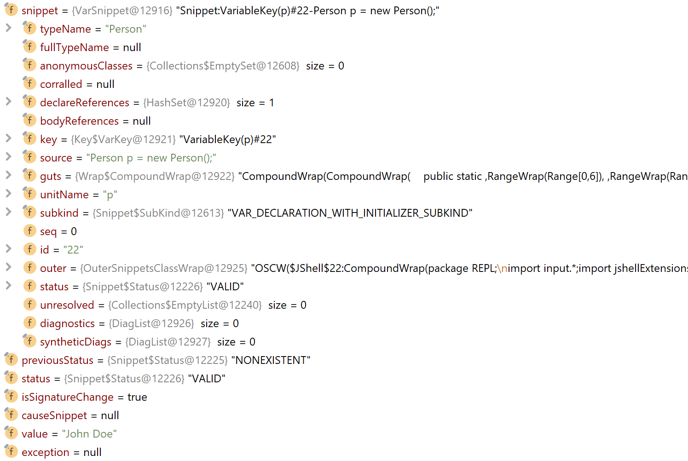
{nbsp} +

Die Deutung der Snippet-Variablenwerte war anfangs etwas schwierig aufgrund der bisher fehlenden Erfahrung im Umgang einer solchen REPL API. Mit Hilfe von simplen, in JShell importierten, Testklassen konnte deren Bedeutung etwas klarer gemacht werden.

Genau wie bei der JShell in REPL Form muss eine Klasse auch beim JShell API zuerst zum Classpath hinzugefügt und importiert werden, damit diese benutzt werden kann.

*Entscheid*

Es wurde schnell klar, dass JShell für diese Arbeit zumindest in Teilen absolut notwendig sein würde.
Die Fähigkeit Java Code zur Laufzeit zu interpretieren alleine macht diese zu einer Notwendigkeit. Dass ebenfalls
Informationen wie die momentan vorhandenen Referenzvariablen und deren zugeordnete Objekttypen abgerufen werden können,
ist ebenfalls sehr praktisch, da so auf eine eigene zur Verwaltung der Referenzen verzichtet werden konnte.
Es wurde daher entschieden JShell nicht nur zur Evaluierung von Code zu benützen, sondern diese auch gleich zur
massgebenden Instanz für die Verwaltung des Systemzustandes zu erklären. Somit konnte die Applikation vor allem
darauf ausgelegt werden, die in der JShell vorhanden Informationen für den Benutzer visuell aufzubereiten.

=== Java to UML Parser

Dieses Kapitel beschreibt mögliche Ansätze um aus .java Files UML darzustellen.

*JavaParser*

Javaparser API kann .java Files parsen und diese in einer
baumartiger Struktur speichern. Dabei können alle nötigen Informationen
herausgefunden werden, welche für die Erstellung eines UMLs relevant sind.
Das Javaparser Projekt ist relativ gut dokumentiert und wird beispielsweise
von IntelliJ verwendet (vgl. <<JavaParser>>: 2019).
Eine erste Variante der InheritorGallery wurde mit JavaParser umgesetzt.
Später wurde jedoch die Generierung des UMLs mithilfe von Reflection erstellt.
Dazu unten mehr.

*JavaSymbolSolver*

Als Teil des Javaparser kann zudem JavaSymbolSolver verwendet werden.
Dieser kann Herkunft der Methodenaufrufe und Variablendeklarationen bestimmen.
Dieses Projekt ist allerdings noch eher neu und wenig verbreitet und dokumentiert.
Auch die Verwendung der JavaSymbolSolver API ist eher umständlich
(vgl. <<Smith>>, Nicholas et al. (2019): 53)

*Reflection*

Nebst dem statischen Java Code muss für die InheritorGallery der
Zustand des Programms zur Laufzeit überwacht werden. Die mit Abstand
verbreitetste Lösung hierfür ist Reflection.

_Reflection is commonly used by programs which require the ability to examine or
modify the runtime behavior of applications running in the Java virtual machine.”_
(<<Reflection>>: 2019)

Auch für die InheritorGallery wurde Reflection verwendet, da es alle benötigten Informationen
für die Darstellung von UML und der Instanzen bereitstellen kann. Reflection liest den
kompilierten Code zur Laufzeit. Dabei sind einige Informationen, die im .java File
vorhanden waren bereits verloren. Dies stellt auch den einzigen Nachteil von Reflection
für dieses Projekt dar. Namentlich kann die Reihenfolge der Definition der Attribute und
Methoden nicht aufrechterhalten werden. Das ist mit JavaParser möglich. Reflection verfügt
jedoch über weitaus mehr Vorteile. Da der Code zur Laufzeit analysiert wird, wird sichergestellt,
dass nur korrekter Code dargestellt wird. Auch die Handhabung von Reflection ist relativ einfach und sehr gut dokumentiert. So kann man etwa die Zusammenstellung
einer Instanz aus den jeweiligen Klassen mit Methoden wie getSuperclass() oder
getInterfaces() einfach und natürlich traversieren. Weiter ist es mit Reflection
möglich die Werte der Attribute herauszulesen oder die Herkunft einer Methode bei
Vererbung ausfindig zu machen.

Beim Implementieren von Reflection zum Lesen von benötigten Informationen zur
Laufzeit wurde festgestellt, dass dabei auch alle Informationen benötigt wurden,
die zur Erstellung des UMLs nötig sind. Folglich wurde auf JavaParser verzichtet,
um den Aufbau der InheritorGallery möglichst einfach und konsistent zu belassen.

*Teilweise vorgefertigte Lösungen*

Hier sollen kurz einige weitere in Betracht gezogene Varianten aufgelistet werden,

die die Erstellung von UML aus .java Files möglich machen.
Der UML-Parser von Github User Shubham Vadhera
(vgl. <<uml-parser-a>>: 2018) benutzt JavaParser für das Einlesen der Files und Yuml
(vgl. <<Yuml>>: 2019) für die Erstellung der Grafiken.
Ähnlich gehen auch Rishiraj Randive
(vgl. <<uml-parser-b>>: 2017)
und Pratik Sanglikar (vgl. <<Java-Parser-UML-Generator>>: 2016) vor.
Diese Lösungen sind für die InheritorGallery eher ungeeignet, da sie zu
unflexibel zu wenig mächtig sind.

== Design

Dieses Kapitel zeigt und erläutert die erstellen visuellen Entwürfe. Dabei werden kurz
die getroffenen Entscheide diskutiert und begründet. Die Entwürfe sind in zwei Gruppen
zusammengefasst: Low Fidelity (LoFi) und High Fidelity (HiFi) Prototypen.

Nebst der Erfassung der Anforderungen, wurde ein dediziertes Interview mit den Auftraggebern
durchgeführt, um das Problem, welches die InheritorGallery lösen soll, genauer zu
beschreiben.

Das komplette Interview ist im Anhang zu finden.
Zusammenfassend wurden folgende Schwierigkeiten oder auch Konzepte
herauskristallisiert:

* Objekt behält Eigenschaft (Infos sind nicht verloren), wenn Oberklasse
zugewiesen
* Methoden nicht mehr aufrufbar, wenn Oberklasse zugewiesen
* Bei überschriebenen Methoden wird die Methode genommen, die zum Objekt passt.
* Subklasse ist eine Spezialisierung, Umfang Funktionalität grösser
* Referenz bestimmt die Sicht (Metapher Pfeil, Brille, Fernrohr)

Diese fünf Punkte wurden bei allen Entwürfen in Betracht gezogen und es
wurde geprüft, ob die Punkte erfüllt sind. Das bedeutet, dass jeder Prototyp
all diese Punkte zumindest implizit und bestenfalls explizit darstellen soll.

*LoFi Prototyp*

Der LoFi Prototyp wurde in enger Zusammenarbeit mit Frau Barbara Scheuner erstellt.
Es wurden immer wieder neue Versionen erstellt und diskutiert. Unten sind einige
Ausschnitte dieser Versionen zu sehen. Alle Entwürfe sind im Ordner
“designs” (https://github.com/FHNW-IP5-IP6/InheritorGallery/tree/doc/docs/designs)
zu finden.

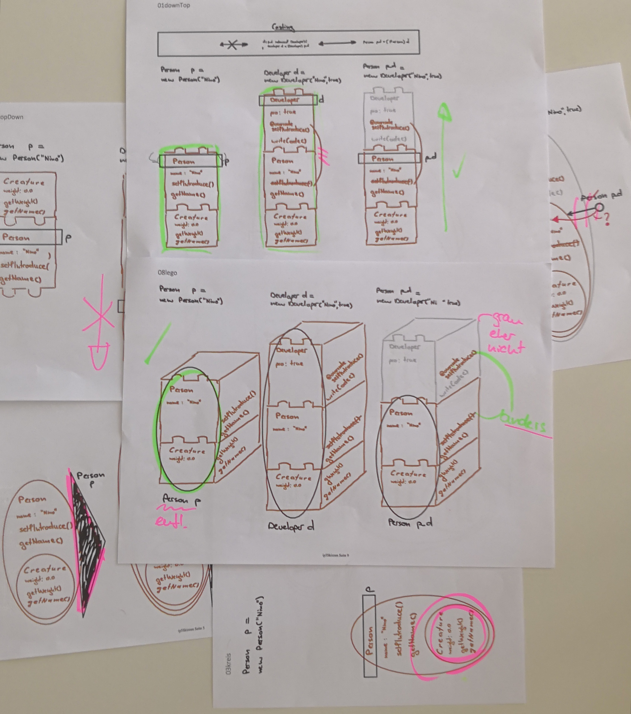
{nbsp} +

Eine der Herausforderungen ist, bei Vererbung darzustellen, dass sich die
Funktionalität erweitert. Dies ist beispielsweise möglich durch ineinander schachteln
von Kreisen oder durch das Stapeln von Elementen. Das Stapeln hat sich als
übersichtlicher und verständlicher erwiesen. Zu erwähnen ist zudem, dass die
Reihenfolge der einzelnen Bausteine im Vergleich zu UML umgedreht ist. Grund dafür
ist die Tatsache, dass die Basisklasse die Grundlage für weitere Klassen bietet und
sich darum zuunterst und nicht wie üblicherweise im UML zuoberst befindet.

Die Referenz auf ein Objekt wird als Kreis dargestellt. Der Kreis umschliesst die
Methoden, die auf der jeweiligen Referenz aufrufbar sind. Zudem ist der Referenzkreis
mit dem Referenznamen angeschrieben. Alternativen sind Punkte mit einem Pfeil, eine
Fernrohr artige Form oder Labels die sich nicht durchgesetzt haben.

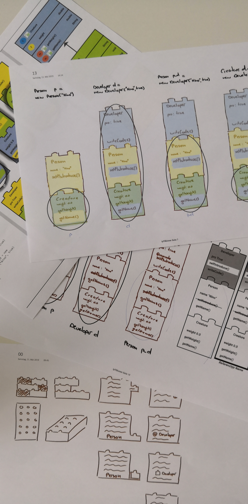
{nbsp} +

Beim Bild oben handelt es sich vor allem um die Darstellung von überschriebenen
Methoden und der expliziten Darstellung von welcher Methode die Implementation
übernommen wird und auf welchen Referenzen die Methode aufrufbar ist.

Im Gegensatz zu einem Klassendiagramm kennt eine Instanz im Falle von überschriebenen
Methoden nur eine Methode. Die Implementation der überschriebenen Methode ist
nicht mehr vorhanden und auch nicht relevant für die Instanz. Die Überschriebene
Methode ist jedoch trotzdem aus dem “allgemeinsten” Teil der Instanz aufrufbar in
dem sie zuerst definiert wurde. Diese Tatsache soll farblich gelöst werden. So sind
die einzelnen Herkunftsklassen einer Instanz farblich markiert und stimmen auch mit
dem UML überein. Zum Beispiel die Methode “getName()” in der Abbildung oben wurde in
der Klasse “Creature” definiert und ist auf einer Referenz vom Typ “Creature” aufrufbar.
Deshalb befindet sich die Methode “getName()” im untersten Teil der Instanz.
Allerdings wird die Methode in der Klasse “Developer” überschrieben, so dass aus
dieser Klasse die Implementation der Methode verwendet wird. So ist die Methode
blau hervorgehoben, nämlich der Farbe der Klasse “Developer”.

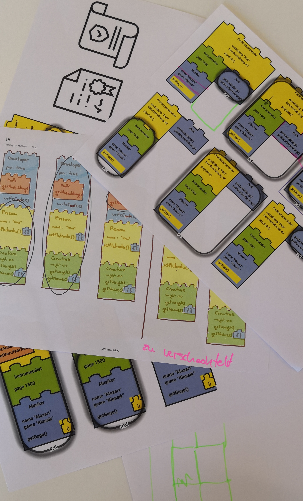
{nbsp} +

Die Abbildung oben widmet sich insbesondere komplexeren Instanzen, die erben und
gleichzeitig Interfaces implementieren. Auch hier gilt zu beachten, dass der Typ
der Referenz auch ein Interface sein kann und so explizit ersichtlich sein muss.
So wurde entschieden eine Instanz bei Implementierung von Interfaces in die breite
wachsen zu lassen. Dadurch lassen sich die aufrufbaren Methode im Falle eines
Interface Referenztypen klar darstellen.

*HiFi Prototyp*

Die gewonnenen Erkenntnisse aus den Interview mit den LoFi Prototypen und den
durchgeführten Usability Test (dazu mehr im Kapitel Usability Testing) wurde ein
HiFi Prototyp erstellt. Der HiFi Prototyp erfüllt zwei Aufgaben. Einerseits wurde
er für Usability Tests verwendet, mit dem Ziel möglichst stark dem Endprodukt zu
gleichen. Andererseits dient er als Umsetzungshilfe für die eigentliche Applikation.
So können Designelemente direkt übernommen werden und es muss bei der Umsetzung
nicht mehr interpretiert werden. Es sind alle benötigten Bausteine wie Pfeile,
Kreise und Icons vorhanden. Alle Icons und Farben können direkt exportiert und
in der JavaFX Applikation eingebunden werden. Der HiFi Prototyp ist unter folgendem
Link aufrufbar:
https://www.figma.com/file/bmuP25sd6U1Mk7zopuCf3ApD/InheritorGallery

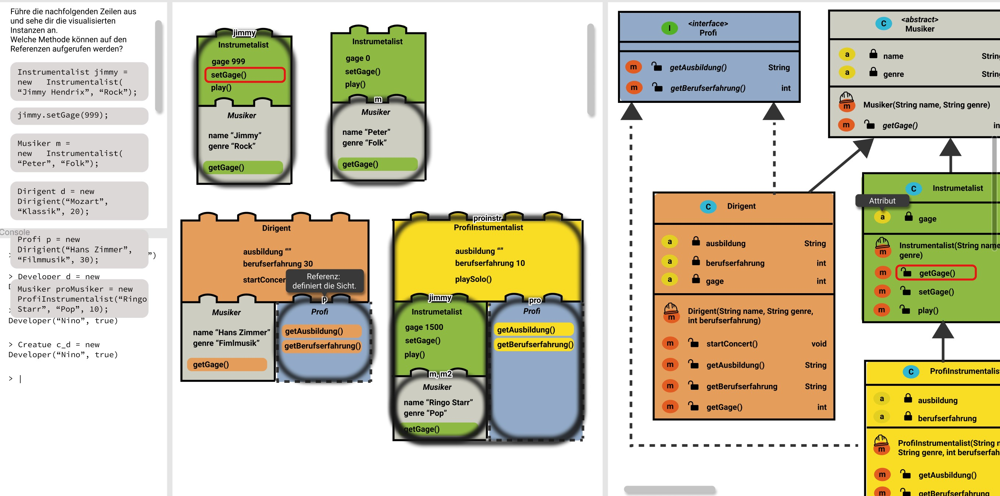
{nbsp} +

Im Gegensatz zum LoFi Prototyp stellt der HiFi Prototyp den gesamten Bildschirm dar.
So sieht man hier oben links die importierte Anleitung und die Konsole zur Eingabe
von Java Commands. Links ist das UML der importierten Übung zu sehen, welches
automatisch generiert werden soll. In der Mitte ist der Hauptteil der Applikation
ersichtlich, die erstellten Instanzen. Die Teile der Instanzen stimmen mit der
Farbgebung aus dem UML überein um klarer zu zeigen, aus welchen Klassen eine
Instanz zusammengesetzt wurde. In Kindklassen überschriebene Methoden werden jeweils
in der Farbe hervorgehoben, in der sich die benutzte Implementation befindet.

== Usability Testing

Dieses Kapitel beschreibt die Art und Weise der durchgeführten
Usability Tests sowie deren Ergebnisse.

=== Präkonzept Test

Vor der Erstellung der ersten Entwürfe wurden nebst den Interviews mit den Dozenten
auch sogenannte Präkonzept Erhebungen mit Studierenden durchgeführt.
Ziel dabei ist, zu verstehen, wie sich die Studierende typische Begriffe im Zusammenhang mit Vererbung visuell vorstellen. So sollen einerseits Ideen gesammelt und andererseits allfällige Entwürfe auf die Erwartungen der Studierenden abgestimmt werden.

Das Vorgehen des Tests gleicht einem Spiel bekannt als Montagsmalen.
Es wurden 11 Begriffe bestimmt und allen Teilnehmenden bekannt gegeben.
Die Begriffe sind: Objekt, Oberklasse, Unterklasse, überschreiben, override,
extends, Erweiterung, Referenz, instanceof, equals(), clone(),
Spezialisierung, Generalisierung.

Am Test nehmen 4 Studierende Teil. Jeder Teilnehmer oder Teilnehmerin zeichnet
die 11 Begriffe in maximal 45 Sekunden. Nachdem alle Begriffe gezeichnet wurden,
werden die Zeichnungen getauscht und deren Reihenfolge vertauscht.
Nun haben die Teilnehmenden 10 Sekunden Zeit pro Bild um die Begriffe der
anderen Teilnehmer zu erraten. Auf dem Bild wird farblich jeweils markiert,
ob ein Bild in gegebener Zeit erraten (grün) wurde oder nicht (rot).

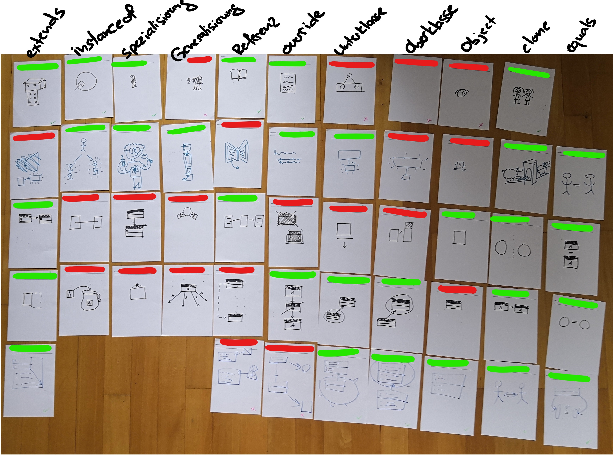
{nbsp} +

Aufgrund der Auswertung oben lässt sich sagen, dass generell sehr viel UML
verwendet wird. Dies ist wenig überraschend, da es meist die einzig bekannte
visuelle Darstellungsform für Java Programme ist. Interessant sind zudem
einige bestimmte Zeichnungen. “Extends” wird als ein Haus auf einem Haus
gezeichnet. Dadurch wird schön sichtbar, dass die Funktionalität erweitert
wird. “Instanceof” wird als ein Kreis gezeichnet, in welches ein Pfeil zeigt.
“Referenz” wurde sehr unterschiedlich gezeichnet und auch schlecht erraten.
Daraus lässt sich schliessen, dass eine Referenz schwer darzustellen
ist und auch noch keine Vorstellungen hierfür vorhanden sind.

=== HiFi Test

In diesem Kapitel wird die Durchführung und Auswertung des Usability Tests mit dem HiFi
Prototyp beschrieben. Die Erstellung der Prototyps ist im Kapitel Entwürfe zu finden.

Test Object ist ein ausgedruckter HiFi Prototyp. Aufgabe ist, die Codezeilen auszuführen
und die erstellten Instanzen zu beschreiben. Das verwendete Klassendiagramm wurde von den
Studierenden in der vorhergehen Lektion soeben in einer Übung verwendet.

Ziel ist zu prüfen, ob die einzelnen Teile der Darstellung und die Gesamtübersicht
klar sind und dabei möglichst viele Fehler und Unklarheiten in der Darstellung ausfindig zu machen.

Der Test wurde auf Video aufgenommen und die Findings anschliessend aufgeschrieben.
Die gesamte Auswertung ist im Anhang zu finden.

image::images/20190517_UsabilityTest.jpg[Momentaufnahme des Usability Tests, 100%, title="Momentaufnahme des Usability Tests"]
{nbsp} +

Aufgrund der Testergebnisse lässt sich zusammenfassend sagen, dass die Darstellungen grösstenteils
selbsterklärend sind und die Konzepte der Vererbung wie gewünscht darstellen. Als Findings
festgehalten wurden unter anderem folgende Punkte:

* Symbol “f” für Field ist unklar. Stattdessen “a” für Attribut verwenden und allenfalls
die Abkürzung mithilfe von Zusatzinformationen bei Hover erläutern.
* Referenz Typen zusätzlich neben dem Referenz Namen anzeigen, z.B. "Musiker m".
Alternativ wird der Referenzname oben am Referenzkreis angezeigt, gleich neben dem
Klassennamen, welcher mit dem Referenztypen übereinstimmt.
* Weitere Kontextinformationen explizit zeigen. z.B. bei Hover auf Referenz
"Referenz: definiert die Sicht”.

=== Beta Test

Der Beta Test wurde mit der erstellten JavaFX Applikation durchgeführt. Die Aufgabe ist, die Applikation selbständig zu bedienen mithilfe der vorhandenen Anleitung.

Ziel ist allfällige Usability Fehler festzuhalten und Bereiche des Designs zu bestimmen, die am meisten Verbesserungspotential aufweisen. Der Test wurde auf Video aufgenommen und die Findings anschliessend aufgeschrieben. Die gesamte Auswertung ist im Anhang zu finden.

Zusammenfassend lässt sich sagen, dass sich die Applikation gut bedienen lässt und auch die Konzepte der Vererbung klar dargestellt werden. Die Applikation weist jedoch noch einige Unschönheiten im Design auf. Beispiele sind:

* Die Pfeilköpfe im UML sind hinter der Klasse versteckt und sind nur teilweise sichtbar.
* Die Schrift und Formatierung der Anleitung ist wenig ansprechend gestaltet und ist nicht gut lesbar. Auch entsteht beim Code kein Zeilenumbruch, so dass gescrollt werden muss um den gesamten Code zu sehen.
* Die Darstellung der Referenz scheint auf die Probanden wenig ansprechend.
* Die Pfeile im UML verlaufen bei komplexeren Objektstukturen hinter den Klassen, was zu Unklarheiten führen kann.

Die Ergebnisse dienen als Grundlage für die Anpassungen der finalen Version der Applikation.

== Implementation

In diesem Kapitel soll die Implementation der Applikation besprochen werden. Es gilt wichtige Designentscheidungen zu begründen und für den Programmablauf kritische Implementationen zu erklären.

=== Architektur

*Architekturmodel*

Als erstes gilt es zu erfassen, welche Anforderungen die Applikation erfüllen muss, um eine grobe Idee über die zu erstellende Architektur zu erhalten. Daraus lässt sich dann ein geeignetes Model zur Strukturierung des Codes ableiten.

Aufgrund der Anforderungsanalyse ergeben sich folgende Kernfunktionen, die die Applikation zur Verfügung stellen muss:

* Eingabe von Java-Code mittels JShell
* Anzeige eines UML Klassendiagramms
* Anzeige von Instanzen
* Laden einer Übung

Es wird klar, dass mit der Applikation über eine graphische Oberfläche interagiert werden können soll. Somit wird ein grosser Teil der Applikation aus Elementen zur Anzeige des momentanen Programmzustands bestehen. Daher bietet es sich an GUI und Programmlogik in jeweils eigene Module auszulagern. Dies hat den Vorteil, dass Logik und Anzeige strikt getrennt sind. Damit ist es potenziell möglich, mit derselben Programmlogik verschiedene Visualisierungen zu unterstützen. Die Programmlogik wird vom Modul “inheritorgallery-core” beinhaltet währenddem die View im Modul “inheritorgallery-demo” liegt.

Aufgrund dieser Voraussetzungen stellt das Presentation Model Pattern eine optimale Möglichkeit dar, wie die Applikation umgesetzt werden kann. Eine Alternative wäre das MVC Pattern, das für ein kleineres Projekt wie dieses jedoch überdimensioniert scheint. Ausserdem ist aus vorherigen Projekten bereits viel PM Know-how beim Projektteam vorhanden.

*Packages*

Die Kernfunktionen können dann weiter in Packages unterteilt werden. Es liegt nahe je ein Package für die Instanz-Logik (“instance”) sowie die UML-Logik (“uml”) sowohl in der View als auch im Backend anzulegen. Alle Presentation Models sollen zusammenfassend unter dem Package “presentationmodel” gehalten werden. Die zur Anzeige der Oberfläche verwendeten Klassen und Packages sollen unter einem umschliessenden Package “view” erstellt werden.

Ausserdem soll ein Package für Services (“service”) angelegt werden. Darin werden dann Services für das Filehandling sowie die JShell erstellt.

*Komponentendiagramm*

Das Komponentendiagramm der fertigen Applikation beinhaltet dann auch die erwähnten Packages. Speziell zu erwähnen ist ebenfalls das Package “jshellExtensions”, das Klassen beinhaltet, die zur Verwendung innerhalb der JShell verwendet werden.

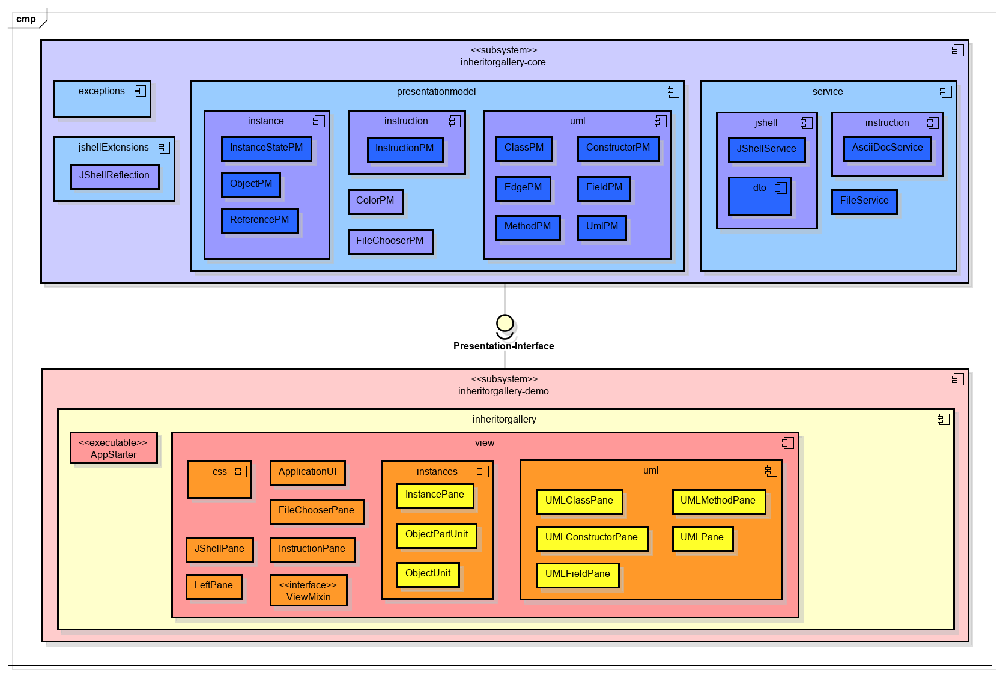
{nbsp} +

=== Programmabläufe

In diesem Kapitel werden die beiden komplexesten Abläufe der Applikation näher erläutert. Speziell das Erstellen des UML Diagramms bedarf genauerer Erklärungen, da das Interagieren mit nur in der JShell existierenden Klassen eher ungewöhnlich ist. Die Beschreibung der Abläufe verzichtet dabei bewusst darauf, sich zu sehr in Details zu verlieren, da diese direkt dem Programmcode entnommen werden können.

*Erstellen des UML Diagramms*

Das UML Diagramm, das in der Applikation angezeigt wird, wird komplett mit Reflection erstellt. So kann ein dynamisches Generieren und das Abdecken verschiedener Inputklassen garantiert werden.

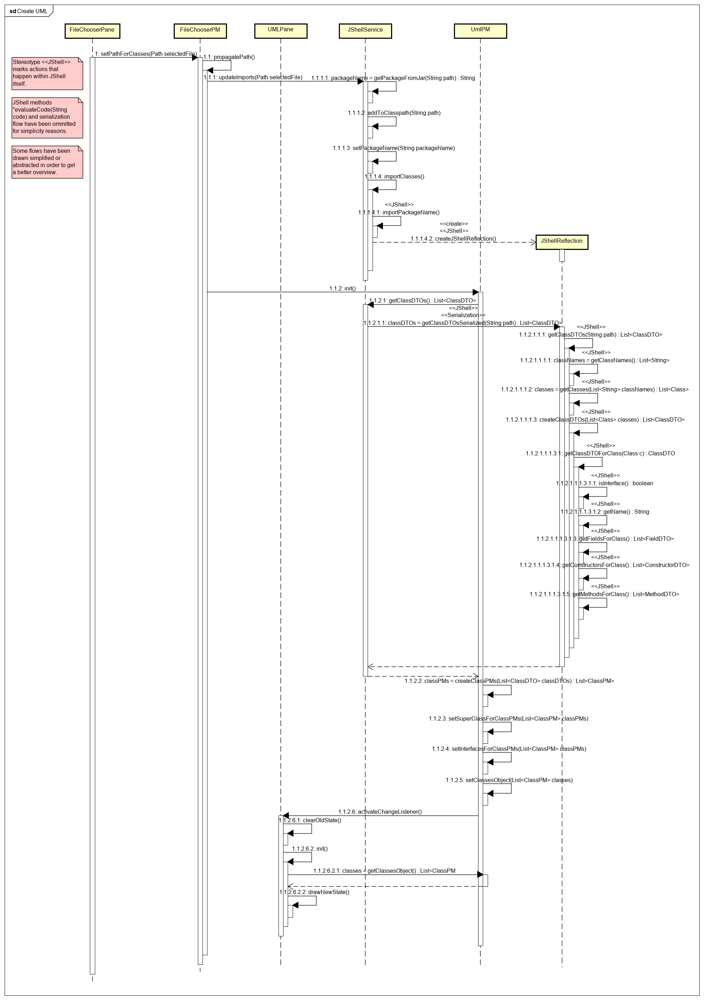
{nbsp} +

Ein Benutzer kann auf der graphischen Oberfläche über die “FileChooserPane” eine .jar-Datei auswählen und vom Programm einlesen lassen. Via das “FileChooserPM” wird der Dateipfad and die Klasse “JShellService ” weitergegeben. Diese stellt das Herz der Applikation dar. JShellService ist die Schnittstelle zur JShell über die Benutzereingaben interpretiert und verwaltet werden.

“JShellService” fügt die ausgewählte .jar-Datei zum JShell-Classpath hinzu und importiert diese. Das ist nötig, damit die importierten Klassen von der Shell interpretiert werden können. Danach erstellt sie die Klasse “JShellReflection” in der JShell.

Für die Verwaltung des UMLs existiert die Klasse “UmlPM”. Diese beinhaltet die importierten Klassen und deren Aufbau. Um an diese Informationen zu gelangen ruft sie mittels “JShellService” die Klasse “JShellReflection” auf. Diese erstellt dann mit Hilfe von Reflection die Klassenobjekte. Dass “JShellReflection” in der JShell erstellt wird, hat den Vorteil, dass diese über die in der JShell existierenden Objektreferenzen informiert ist. Dies ist später bei der Erstellung der Instanzen von Wichtigkeit.

Via Serialisierung werden die erstellten KlassenDTOs wieder an “UmlPM” gesendet, die diese weiterverarbeitet und schliesslich der View “UMLPane” zur Anzeige übergibt.

*Erstellen der Instanzen*

Benutzereingaben werden via die “JShellPane” an das “InstanceStatePM” weitergeleitet. Dieses speichert die Befehle und übernimmt die Interaktion mit der Klasse “JShellService”. Das Presentation Model liefert dem Benutzer Rückmeldungen zur Gültigkeit seiner Eingaben und erstellt intern die “ObjectPM” Objekte, die für die Anzeige auf der Instanzen und der Referenzen der graphischen Oberfläche benötigt werden. Die Informationen dazu werden von “JShellService” mittels DTOs geliefert. Sollte der Benutzer eine Referenz = null gesetzt haben, wird diese entsprechend gelöscht.

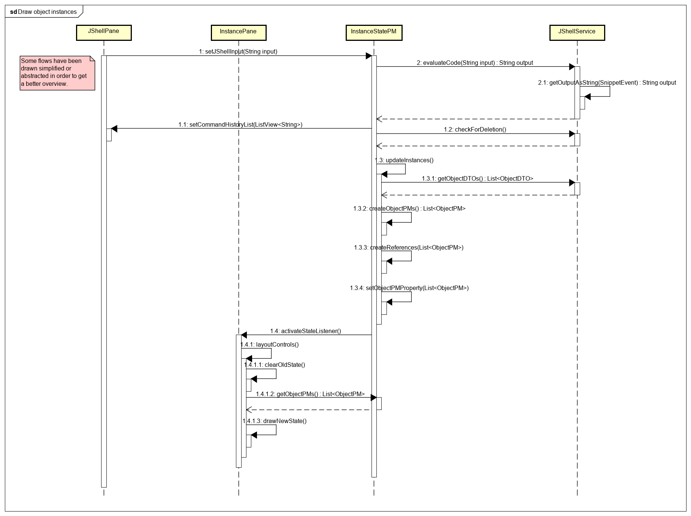
{nbsp} +

Die Applikation nutzt die JShell zur Verwaltung des Programmzustands inklusive Benutzereingaben und Referenzen. Eine weitere Möglichkeit wäre es gewesen, dies Eingaben und Referenzen in der Applikation zu verwalten. Dazu hätten jedoch ein eigenes Model sowie ein Handler zur Speicherung und Verarbeitung dieser Daten geschrieben werden müssen. Da JShell diese Funktionen bereits bietet, wurde entschieden, JShell diese Daten verwalten zu lassen.

Dies bedeutet jedoch, dass bei jeder Benutzereingabe der aktuelle Stand der JShell abgerufen und alle Instanzen und Referenzen neu erstellt werden müssen. Durch Setzen eines entsprechenden Properties wird ein Listener der “InstancePane” informiert, dass die Instanzen neu gezeichnet werden müssen.

=== Contiuous Integration

Für eine Arbeit dieser Grösse und über einen längeren Zeitraum macht es durchaus Sinn eine Contiuous Integration (CI) aufzubauen. So können mittels fehlschlagenden Tests schnell Fehler im Quellcode ausfindig gemacht werden.

Die Arbeit ist jedoch nicht gross genug, dass eine umfangreiche Buildpipeline mit einer eigenen CI-Infrastruktur gerechtfertigt wäre. Deshalb wurde auf das leichtgewichtige Travis CI gesetzt. Travis hat den Vorteil, dass bereits eine cloudbasierte Infrastruktur existiert, die als Student gratis genutzt werden kann. Ausserdem bietet Travis eine optimale Integration mit GitHub. Über eine .yml-Konfigurationsdatei kann das CI-Werkzeug konfiguriert werden.

Da die Applikation auf Windows-basierten Rechnern entwickelt wurde, wurde entschieden auf eine Unix-basierte Buildmaschine zu setzen, da so plattformspezifische Fehler erkannt werden konnten. Diese Entscheidung erwies sich aufgrund von Problemen bei plattformspezifischen Dateipfaden als korrekt.

Travis wurde so konfiguriert, dass bei jedem Git Push oder Pull Request auf GitHub ein Build erstellt wird. Dieser muss zwingend erfolgreich sein, damit ein Git Merge durchgeführt werden kann.

=== Kurzanleitung

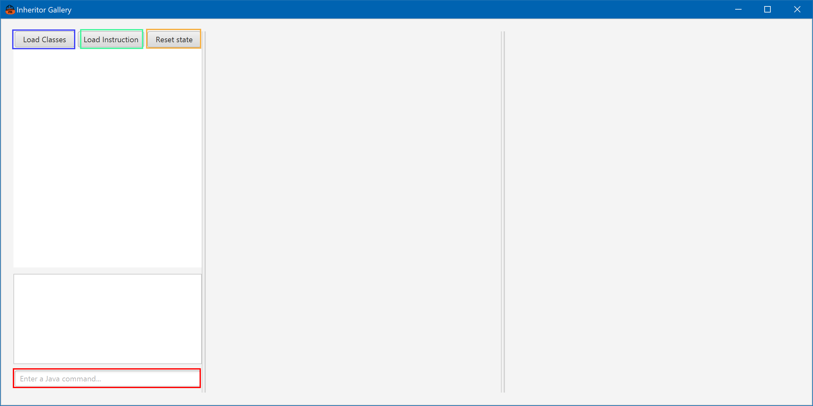
{nbsp} +

Die Applikation bietet dem Benutzer 4 Möglichkeiten zur Interaktion.

*Laden von Klassen*

Mit dem Button “Load Classes” (oben in blau) können neue Klassen geladen werden. Nach Klick auf den Button, wird der Benutzer oder die Benutzerin aufgefordert, eine .jar-Datei auszuwählen.
Sobald diese geladen ist, wird entsprechend der geladenen Klassen ein neues Klassendiagramm generiert und die Klassen in die JShell importiert.
Die neuen Klassen können nun verwendet werden.

*Laden einer Anleitung*

Mit dem Button “Load Instruction” (oben in grün) kann eine neue Anleitung geladen werden. Nach Klick auf den Button, wird der Benutzer oder die Benutzerin aufgefordert, eine .adoc-Datei auszuwählen.
Sobald diese geladen ist, wird sie unterhalb der Buttons angezeigt. Die .adoc-Dateien müssen in AsciiDoc geschrieben sein, um korrekt angezeigt zu werden.

*Reset der Applikation*

Mit dem Button “Reset state” (oben in orange) kann ein Benutzer oder eine Benutzerin den Stand der Applikation zurücksetzen. Nach Klick auf den Button werden alle Instanzen gelöscht und somit nicht mehr angezeigt.

*Interaktion mit der Applikation*

Mit dem Textfeld links unten (oben in rot) kann ein Benutzer oder eine Benutzerin Javacode an die JShell übermitteln. Es können z.B. neue Instanzen erstellt oder Methoden auf Referenzen ausgeführt werden.
Genau wie in Java muss jede Codezeile mit einem Semikolon (;) abgeschlossen werden. Wird dieses vergessen, kann JShell den Code nicht interpretieren.
Eine neu erstellte Instanz wird Links neben dem Klassendiagramm angezeigt. Dabei wird der Referenztyp umrahmt und zeigt so die Sicht an, die momentan auf die Instanz möglich ist. Methoden ausserhalb der Referenzsicht, sind dementsprechend nicht ausführbar.
Wenn eine Methode ausgeführt wird, wird im Klassendiagramm die gerade ausgeführte Methode gemäss Vererbungshierarchie korrekt angezeigt.

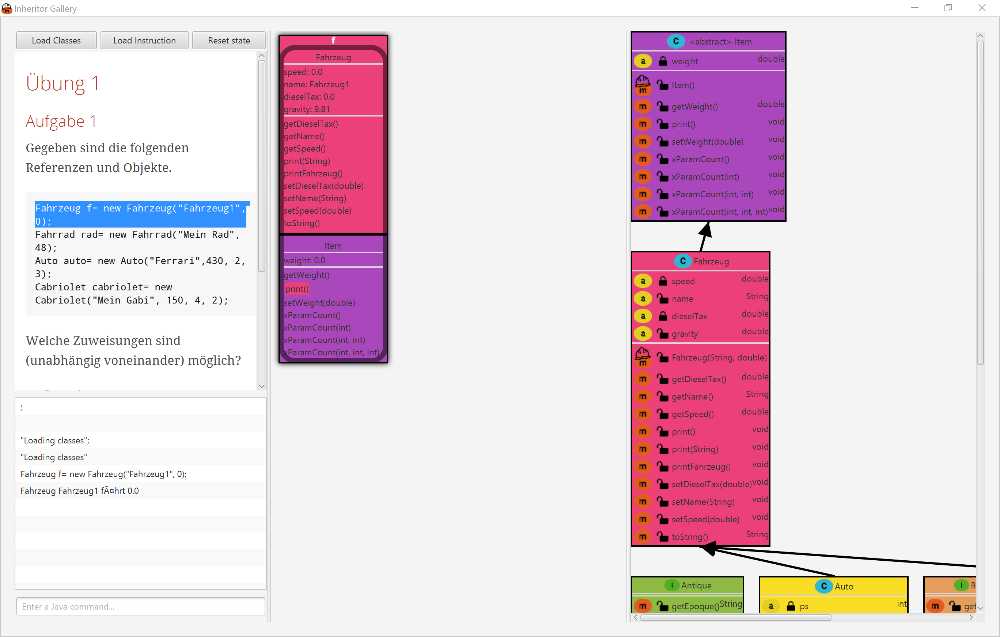
{nbsp} +

== Ergebnisse

Aufgrund der Analyse der vorhandenen Darstellungen und Tools für Programmieranfänger lässt sich festhalten, dass keine Lösungen gefunden wurden, um Instanzen eines Java Programms visuell verständlich darzustellen.

Gemäss den Ergebnissen der durchgeführten Usability Test und der Interviews konnte eine Darstellungsart entworfen werden, um die erstellten Instanzen zur Laufzeit eines Java Programms geeignet darzustellen. Alle wesentlichen Aspekte der Vererbung sind in der Visualisierung explizit sichtbar. Beispielsweise ist klar, welche Methoden auf einer Referenz jeweils aufrufbar sind und welche Methoden Implementation bei Vererbung gewählt wird.

Es konnten alle in der Projektvereinbarung definierten funktionale Anforderungen umgesetzt werden. So können in die erstellte JavaFX Applikation Java Programme in Form von .jar Dateien importiert werden und auch eine Anleitung geladen werden. Daraus wird ein UML generiert und dargestellt. Die Applikation verfügt über eine Shell, in der Java Code eingegeben werden kann und der Rückgabewert wird jeweils in einer Liste angezeigt. Und allem voran werden die erstellten Instanzen angezeigt, so dass klar wird was die Instanz ausmacht.

Bei den nicht funktionalen Anforderungen konnte die Anforderung “Die Applikation soll mit jlink lauffähig sein und somit eigenständig ausgeführt werden können.” aus Zeitgründen nicht komplett umgesetzt werden können.
//Todo: jlink ergänzen?

Allerdings gilt es noch zu prüfen, wie sich die Applikation im Unterrichtsalltag bewährt. Die Usability Tests wurden aufgrund der Projektgrösse in sehr beschränkter Zahl durchgeführt. Auch die Usability der JavaFX Applikation gilt es weiter zu testen und zu verbessern.

Zusammenfassend lässt sich sagen, dass eine für Programmieranfänger hilfreiche Darstellung entworfen werden konnte und erfolgreich in der JavaFX Applikation umgesetzt wurde.

== Schlusswort

In diesem Kapitel soll als Ergänzung zum Kapitel Ergebnisse der Arbeitsprozess für bei der Durchführung dieses IP5 Projektes reflektiert werden. Das es hier um persönliche Erfahrungen der Verfasser dieses Berichts geht, ist dieses Kapitel in Wir-Form geschrieben.

Die Zusammenarbeit mit den Betreuenden hat sehr gut funktioniert. So konnten früh im Projekt Entwürfe unkompliziert und häufig diskutiert werden und auch später bei der Erstellung der JavaFX Applikation konnte mithilfe der Issues in GitHub rasch und effizient Hilfe eingeholt werden.
Zufrieden sind wir auch mit dem Einsatz der verwendeten Toolchain. So hat das Einrichten der Continuous Integration mit Travis zwar zu Beginn zu einigem Aufwand geführt, während der Entwicklung konnten so jedoch Fehler frühzeitig erkannt werden. Auch die Arbeit mit Issues und Branches in Github konnte effizient durchgeführt werden.

Als eher schwierig hat sich die Rekrutierung von geeigneten Probanden erwiesen. Je nach Priorisierung im Projekt, würden wir hier ein nächstes mal mehr Zeit investieren. Weiter wurde während der Entwicklung teilweise zu viel Zeit für gewisse Funktionalitäten aufgewendet. Beispielsweise hat die Implementierung der Imports von .jar Files in JShell viele unerwartete Herausforderungen mit sich gebracht. Hier würden wir ein nächstes mal früher innehalten und prüfen, ob diese Funktionalität umgesetzt werden soll oder besser die Anforderungen besser neu priorisiert werden müssen.

Sehr positiv war das Erlebnis der Zusammenarbeit mit GitHub und der Continuous Integration. Da wir meist auf unterschiedlichen Branches und nicht an denselben Files arbeiteten stiessen wir auf keine nennenswerten Probleme. Falls doch einmal unsauberer Code gepushed wurde, so konnte dies mit Hilfe von Travis CI schnell ausfindig gemacht werden.

Zusammenfassend sind wir mit der Umsetzung des Projektes sehr zufrieden und sind der Ansicht die Arbeitsmittel effizient und gewinnbringend eingesetzt zu haben.

== Literatur

[bibliography]

- [[[Smith]]] , Nicholas et al. (2019):  Javaparser: Visited - Analyse,
transform and generate your Java code base. Leanpub

- [[[Lucidchart]]] (2019) https://www.lucidchart.com (abgerufen am 24.07.2019).

- [[[Jive]]] (2019) https://cse.buffalo.edu/jive/ (abgerufen am 24.07.2019).

- [[[Visualizing-java]]] (2019) https://daveagp.wordpress.com/2013/07/05/visualizing-java/ (abgerufen am 24.07.2019).

- [[[ObjectGraphVisualization]]] (2019) https://github.com/Nurtak/ObjectGraphVisualization (abgerufen am 24.07.2019).

- [[[BlueJ]]] (2019) https://bluej.org/ (abgerufen am 24.07.2019).

- [[[JavaParser]]] (2019) https://javaparser.org/ (abgerufen am 24.07.2019).

- [[[Reflection]]] (2019) https://docs.oracle.com/javase/tutorial/reflect/ (abgerufen am 24.07.2019).

- [[[uml-parser-a]]] (2018) https://github.com/shubhamvadhera/uml-parser (abgerufen am 24.07.2019).

- [[[Yuml]]] (2019)  https://yuml.me/ (abgerufen am 24.07.2019).

- [[[uml-parser-b]]] (2017) https://github.com/rishirajrandive/uml-parser (abgerufen am 24.07.2019).

- [[[Java-Parser-UML-Generator]]] (2016)
https://github.com/pratiksanglikar/Java-Parser-UML-Generator:
(abgerufen am 24.07.2019).

- [[[Oracle-a]]] (2018) https://docs.oracle.com/javase/10/jshell/introduction-jshell.htm#JSHEL-GUID-630F27C8-1195-4989-9F6B-2C51D46F52C8 (abgerufen am 27.07.2019).

- [[[Vojtech]]] (2018) https://www.vojtechruzicka.com/jshell-repl/ (abgerufen am 27.07.2019).

- [[[Field]]] (2017) http://cr.openjdk.java.net/~rfield/tutorial/JShellTutorial.html#commands----introduction (abgerufen am 29.07.2019).

- [[[Kotari]]] (2017) https://dzone.com/articles/jdk9-execute-java-code-like-unix-shell-script (abgerufen am 29.07.2019).

- [[[Oracle-b]]] (2017) https://docs.oracle.com/javase/9/docs/api/jdk/jshell/package-summary.html (abgerufen am 29.07.2019).

== Ehrlichkeitserklärung

Hiermit erklären wir, die vorliegende Facharbeit selbständig, ohne Hilfe Dritter und nur unter Benutzung angegebener Quellen verfasst zu haben.

Ort, Datum: 	Windisch, 13. August 2019

Diese Ehrlichkeitserklärung gilt mit einem separatem Pull Request der Verfasser als unterzeichnet.

== Anhang

include::anhang/projektvereinbarung.adoc[]

include::anhang/requirements.adoc[]

include::anhang/20190408_interviewDozent.adoc[]

include::anhang/usabilityTestHiFi.adoc[]

include::anhang/usabilityTestBeta.adoc[]

include::anhang/requirements.adoc[]

