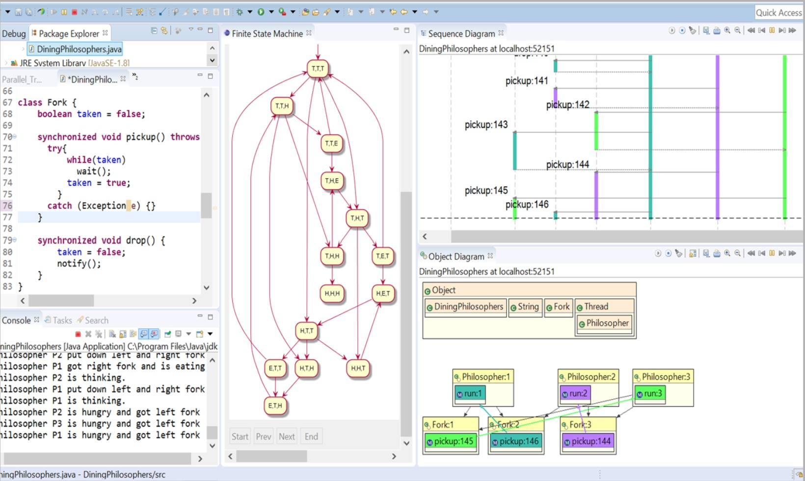
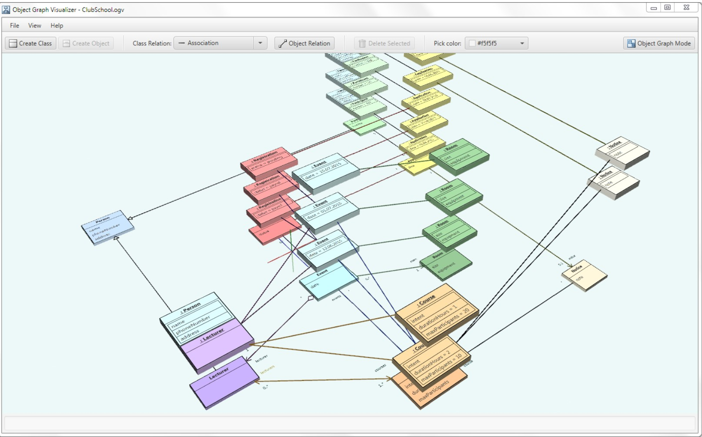
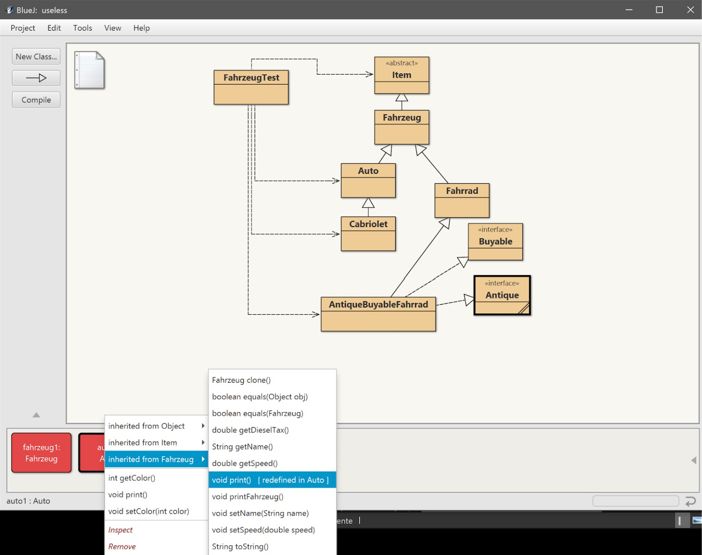

= InheritorGallery
:toc: macro
:toc-title:
:toclevels: 4

*InheritorGallery*

*IP5 Projektbericht*

Verfasser: Dimitri Muralt, Christoph Wenk

Studiengang: iCompetence

Betreuer und Auftraggeber: Barbara Scheuner, Dieter Holz

Windisch, 13. August 2019

// Path to the code references
:sourcedir: ../inheritorgallery-core/src/main/java
:sourcedirdemo: ../inheritorgallery-demo/src/main/java/inheritorgallery

== Zusammenfassung

//Todo: Zusammenfassung

== Inhalt

toc::[]

== Einleitung

Dieser Bericht beschreibt die Analyse und Entstehung der Applikation mit dem Namen InheritorGallery. Zielgruppe dieser Applikation sind Programmieranfänger im Bereich der objektorientierten Programmierung mit Java. 

Die InheritorGallery soll eine für Programmieranfänger geeignete Darstellung einer Instanz bieten. So soll beispielsweise im Falle von Vererbung klar werden, aus welchen Klassen diese Instanz besteht. Bisher bekannte Darstellungen wie UML sind für die Darstellung einer Instanz unzureichend. Die gesamte Problemstellung ist im Kapitel Problemstellung zu finden.

In dieser Arbeit sollen bereits vorhandene Darstellungen einer Instanz ausgewertet werden. Weiter werden eigene Visualisierungen entworfen und mir Studierenden getestet. Schliesslich soll eine Applikation mit JavaFX umgesetzt werden, welche eine Visualisierung der Instanzen ermöglicht. Die detaillierte Projektvereinbarung ist im Anhang zu finden. Die Applikation soll keinen Debugger ersetzen, sondern die relevanten Informationen im Bereich der objektorientierten Vererbung darstellen.

Im Hauptteil des Berichts werden aktuell vorhandene Darstellungen analysiert, selbst erstellte Entwürfe getestet und die Umsetzung der JavaFX Applikation beschrieben. Im Kapitel Ergebnisse werden die Resultate und Erreichung der Projektvereinbarung diskutiert. Das Schlusswort stellt eine Reflexion über der Arbeitsprozess dar. Wesentlicher Bestandteil ist zudem die erstellte JavaFX Applikation, die unter 
// Todo: Applikation referenzieren
zu finden ist.

== Hauptteil

In diesem Kapitel ist die Analyse und Entstehung der Applikation InheritorGallery beschrieben.
Die einzelnen Kapitel sind nicht zwingend chronologisch geordnet sondern sind in
Themenbereiche gruppiert. Nachdem das Kapitel Problemstellung die zu lösenden Aufgabe
aufzeigt, sind im Kapitel Analyse die bereits vorhanden und eingesetzten Technologien
beschrieben. Weiter wird im Kapitel Design und Usability Testing die Entstehung und das
Testen der Prototypen erklärt und schliesslich wird im Kapitel Implementation die
technische Umsetzung geschildert.

=== Problemstellung

Dieser Abschnitt beschreibt die Aufgabenstellung und wurde übernommen aus dem Projektauftrag übernommen.

https://github.com/FHNW-IP5-IP6/InheritorGallery/tree/doc/docs/anhang/IMVS21inheritorGallery.pdf

*Ausgangslage*

Das Klassendiagramm von UML stellt die Vererbungsbeziehungen zwischen Klassen und Interfaces dar. Dabei werden die Klassen mit ihren Attributen und Methoden als einzelne Quadrate gezeigt. Für die resultierenden Instanzen einer abgeleiteten Klasse ist diese Darstellung irreführend. Für das Verständnis was eine Instanz ausmacht wäre es für einen Programmieranfänger deutlich einfacher wenn die Instanz als eine Einheit visualisiert wird und nicht in mehreren Blöcken.

Eine für Programmieranfänger geeignete Visualisierung von Instanzen müsste:

- die verfügbaren Methoden und Attribute und deren Ursprungs-Klasse bzw. Interface nachvollziehbar machen
- den statischen und dynamischen Typ eines Attributs bzw. einer Variablen berücksichtigen

Ein Debugger bietet einige dieser Informationen an. Eine grafische Visualisierung existiert derzeit nicht.

*Ziel der Arbeit*

Entwicklung einer interaktiven Lernumgebung für den Einsatz im Unterricht für Programmieranfänger auf Basis JavaFX.
Für den Programmieranfänger soll es möglich sein, typische Aufgabenstellungen und Programmier-Übungen im Bereich
Vererbung und Polymorphie schrittweise zu implementieren und mit bestehenden Klassenhierarchien zu experimentieren.
Die entstehenden Instanzen sollen geeignet graphisch visualisiert werden.

*Problemstellung*

InheritorGallery besteht aus zwei Teilen

- Autorensystem mit dem neue Übungen erstellt werden (insbesondere Vererbungsstrukturen)
- Lernsystem mit dem der Programmieranfänger die Übungen durchführt

Für beide Teile

- Evaluation bestehender Ansätze und Lösungen
- Evaluation geeigneter Technologien

Für die Lernumgebung

- Entwurf eines geeigneten User-Interfaces
- systematische Usability-Tests zur Weiterentwicklung der User-Interfaces
- Entwurf der Visualisierung von Instanzen von Klassen mit mehreren Oberklassen und Interfaces
- dynamische Veränderung der Visualisierung je nach Programmzustand

=== Analyse

==== Visualisierung Instanzen in Java

Dieses Kapitel beschäftigt sich mit bereits vorhandenen Lösungen zur Visualisierung von Java Programmen.
Der Fokus dabei ist auf die Visualisierung von Instanzen. Zudem sollen die gesuchten Lösungen bereits vorhandene
Programme visualisieren und nicht erst innerhalb der jeweiligen Lösung erstellt werden müssen.

*Visualisierungstools für UML*

Für vorhandene Java Programme können problemlos UML Diagramme erstellt werden. Hierfür sind diverse Tools wie Asta
und Lucidchart (vgl. <<Lucidchart>>: 2019) zu finden und es sind auch Plugins für IDEs
wie IntelliJ oder Eclipse vorhanden.

UML sagt nicht genügend über den Programmzustand zur Laufzeit aus, was jedoch zur Visualisierung von Instanzen
und Vererbung zwingend notwendig ist. So sind auch hier Tools zu finden, die ein Java Programm zur Laufzeit sehr
detailliert darstellen. Solche Tools wie Jive (vgl. <<Jive>>: 2019)  oder
Java Visualizer (vgl. <<Visualizing-java>>: 2019) eignen sich gut zum Debuggen jedoch eher wenig zum
Erlernen von Vererbung für Programmieranfänger.

*Visualisierung von Instanzen*

Es wurden zwei Programme gefunden, die Java Instanzen visualisieren und sich an Programmieranfänger richten
und somit am ehesten auf die Anforderungen dieser Arbeit eignen.
Das erste Programm heisst ObjectGraphVisualization
(vgl. <<ObjectGraphVisualization>>:  2019).
Es handelt sich hier um eine Bachelorarbeit zweier Studierender der HSG aus dem Jahr 2015.
Das Programm ist mit JavaFX
umgesetzt. Der grösste Vorteil von ObjectGraphVisualization ist die Darstellung die sich an Studierende richtet.
Ein grosser Nachteil ist allerdings, dass kein Java Code eingelesen werden kann, sonder die Strukturen mihilfe von
XML erstellt werden müssen. Die gesamte Bachelorarbeit ist unter dem Link https://eprints.hsr.ch/459/ zu finden.

Das zweite Programm heisst Bluej (vgl. <<BlueJ>> 2019).
Dieses entspricht als Gesamtlösung wohl am ehesten den Anforderungen für dieses Projekt.
Es kann Java Code eingelesen oder geschrieben werden. Dabei wird ein vereinfachtes Klassendiagramm angezeigt.
Bluej verfügt zudem über eine Konsole und es können Instanzen angezeigt werden und mit diesem kann man auch
interagieren.
Die verfügbaren Methoden werden in Dropout Menüs angezeigt. Der Nachteil hier ist die mangelnde
Darstellung der Vererbung. Die Instanzen sehen stets gleich aus, bestehend aus einem einzigen Viereck.
Die verfügbaren Methoden müssen via Menüs aufgerufen werden und sind nicht auf einen Blick sichtbar.
Zudem wird nicht klar welche Methoden bei Vererbung ausgeführt werden.

==== JShell

//Todo: JShell

*Tutorials*

- http://blog.thibaulthelsmoortel.be/java/introducing-jshell-and-its-api/

- http://cr.openjdk.java.net/~rfield/tutorial/JShellTutorial.html

- https://www.vojtechruzicka.com/jshell-repl/

*Examples (Run JShell from Java App)*
https://dzone.com/articles/jdk9-execute-java-code-like-unix-shell-script
Link to GitHub repo with example project: https://github.com/kotari4u/jshell_script_executor

*Hints*
*External Code*
JShell can only interpret .class files or .jsh files.
You need to set a classpath for JShell: `jshell> /env --class-path myOwnClassPath`
Import the packages with the classes you need: `jshell> import my.cool.code.*`

*Execution on startup*
http://cr.openjdk.java.net/~rfield/tutorial/JShellTutorial.html#start-up-scripts

*Using JShell in code*
https://www.vojtechruzicka.com/jshell-repl/#using-jshell-programmatically

==== Java to UML Parser

Dieses Kapitel beschreibt mögliche Ansätze um aus .java FIles UML darzustellen.

*JavaParser*

Javaparser API kann .java Files parsen und diese in einer
baumartiger Struktur speichern. Dabei können alle nötigen Informationen
herausgefunden werden, welche für die Erstellung eines UMLs relevant sind.
Das Javaparser Projekt ist relativ gut dokumentiert und wird beispielsweise
von IntelliJ verwendet (vgl. <<JavaParser>>: 2019).
Eine erste Variante der InheritorGallery wurde mit JavaParser umgesetzt.
Später wurde jedoch die Generierung des UMLs mithilfe von Reflection erstellt.
Dazu unter mehr.

*JavaSymbolSolver*

Als Teil des Javaparser kann zudem JavaSymbolSolver verwendet werden.
Dieser kann Herkunft der Methodenaufrufe und Variablendeklarationen bestimmen.
Dieses Projekt ist allerdings noch eher neu und wenig verbreitet und dokumentiert.
Auch die Verwendung der JavaSymbolSolver API ist eher umständlich
(vgl. <<Smith>>, Nicholas et al. (2019): 53)

*Reflection*

Nebst den statischen Java Code muss für die InheritorGallery der
Zustand des Programms zur Laufzeit überwacht werden. Die mit abstand
verbreitetste Lösung hierfür ist Reflection.

_Reflection is commonly used by programs which require the ability to examine or
modify the runtime behavior of applications running in the Java virtual machine.”_
(<<Reflection>>: 2019)

Auch für die InheritorGallery wurde Reflection verwendet, da es alle benötigten Informationen
für die Darstellung von UML und der Instanzen bereitstellen kann. Reflection liest den
kompilierten Code zur Laufzeit. Dabei sind einige Informationen, die im .java File
vorhanden waren bereits verloren. Dies stellt auch den einzigen Nachteil von Reflection
für dieses Projekt dar. Namentlich kann die Reihenfolge der Definition der Attribute und
Methoden nicht aufrechterhalten werden. Das ist mit JavaParser möglich. Reflection verfügt
jedoch über weitaus mehr Vorteile. Da der Code zur Laufzeit analysiert wird, wird sichergestellt,
dass nur korrekter Code dargestellt wird. Auch die Handhabung von Reflection ist r
elativ einfach und sehr gut dokumentiert. So kann man etwa die Zusammenstellung
einer Instanz aus den jeweiligen Klassen mit Methoden wie getSuperclass() oder
getInterfaces() einfach und natürlich traversieren. Weiter ist es mit Reflection
möglich die Werte der Attribute herauszulesen oder die Herkunft einer Methode bei
Vererbung ausfindig zu machen.

Beim Implementieren von Reflection zum Lesen von benötigten Informationen zur
Laufzeit wurde festgestellt, dass dabei auch alle Informationen benötigt wurden,
die zur Erstellung des UMLs nötig sind. Folglich wurde auf JavaParser verzichtet,
um den Aufbau der InheritorGallery möglichst einfach und konsistent zu belassen.

*Teilweise vorgefertigte Lösungen*

Hier sollen kurz einige weitere in Betracht gezogene Varianten aufgelistet werden,

die die Erstellung von UML aus .java Files möglich machen.
Der UML-Parser von Github User Shubham Vadhera
(vgl. <<uml-parser-a>>: 2018) benutzt JavaParser für das Einlesen der Files und Yuml
(vgl. <<Yuml>>: 2019) für die Erstellung der Grafiken.
Ähnlich gehen auch Rishiraj Randive
(vgl. <<uml-parser-b>>: 2017)
und Pratik Sanglikar (vgl. <<Java-Parser-UML-Generator>>: 2016) vor.
Diese Lösungen sind für die InheritorGallery eher ungeeignet, da sie zu
unflexibel zu wenig mächtig sind.

=== Design

Dieses Kapitel zeigt und erläutert die erstellen visuellen Entwürfe. Dabei werden kurz
die getroffenen Entscheide diskutiert und begründet. Die Entwürfe sind in zwei Gruppen
zusammengefasst: Low Fidelity (LoFi) und High Fidelity (HiFi) Prototypen.

Nebst der Erfassung der Anforderungen, wurde ein dediziertes Interview mit den Auftraggebern
durchgeführt, um das Problem, welches die InheritorGallery lösen soll, genauer zu
beschreiben.

Das komplette Interview ist im Anhang zu finden.
Zusammenfassend wurden folgende Schwierigkeiten oder auch Konzepte
herauskristallisiert:

* Objekt behält Eigenschaft (Infos sind nicht verloren), wenn Oberklasse
zugewiesen
* Methoden nicht mehr aufrufbar, wenn Oberklasse zugewiesen
* Bei überschriebenen Methoden wird die Methode genommen, die zum Objekt passt.
* Subklasse ist eine Spezialisierung, Umfang Funktionalität grösser
* Referenz bestimmt die Sicht (Metapher Pfeil, Brille, Fernrohr)

Diese fünf Punkte wurden bei allen Entwürfen in Betracht gezogen und es
wurde geprüft, ob die Punkte erfüllt sind. Das bedeutet, dass jeder Prototyp
all diese Punkte zumindest implizit und bestenfalls explizit darstellen soll.

*LoFi Prototyp*

Der LoFi Prototyp wurde in enger Zusammenarbeit mit Frau Barbara Scheuner erstellt.
Es wurden immer wieder neue Versionen erstellt und diskutiert. Unten sind einige
Ausschnitte dieser Versionen zu sehen. Alle Entwürfe sind im Ordner
“designs” (https://github.com/FHNW-IP5-IP6/InheritorGallery/tree/doc/docs/designs)
zu finden.

image::images/20190507_DiskussionErsteSkinnen.jpg[LoFi Prototyp 1, 100%]

Eine der Herausforderungen ist, bei Vererbung darzustellen, dass sich die
Funktionalität erweitert. Dies ist beispielsweise möglich durch Ineinanderschachteln
von Kreisen oder durch das Stapeln von Elementen. Das Stapeln hat sich als
übersichtlicher und verständlicher erwiesen. Zu erwähnen ist zudem, dass die
Reihenfolge der einzelnen Bausteine im Vergleich zu UML umgedreht ist. Grund dafür
ist die Tatsache, dass die Basisklasse die Grundlage für weitere Klassen bietet und
sich darum zuunterst und nicht wie üblicherweise im UML zuoberst befindet.

Die Referenz auf ein Objekt wird als Kreis dargestellt. Der Kreis umschliesst die
Methoden, die auf der jeweiligen Referenz aufrufbar sind. Zudem ist der Referenzkreis
mit dem Referenznamen angeschrieben. Alternativen sind Punkte mit einem Pfeil, eine
Fernrohr artige Form oder Labels die sich nicht durchgesetzt haben.

image::images/20190513_BesprechungSkizzen.jpg[LoFi Prototyp 2, 100%]

Beim Bild oben handelt es sich vor allem um die Darstellung von überschriebenen
Methoden und der expliziten Darstellung von welcher Methode die Implementation
übernommen wird und auf welchen Referenzen die Methode aufrufbar ist.

Im Gegensatz zu einem Klassendiagramm kennt eine Instanz im Falle von überschriebenen
Methoden nur eine Methode. Die Implementation der überschriebenen Methode ist
nicht mehr vorhanden und auch nicht relevant für die Instanz. Die Überschriebene
Methode ist jedoch trotzdem aus dem “allgemeinsten” Teil der Instanz aufrufbar in
dem sie zuerst definiert wurde. Diese Tatsache soll farblich gelöst werden. So sind
die einzelnen Herkunftsklassen einer Instanz farblich markiert und stimmen auch mit
dem UML überein. Zum Beispiel die Methode “getName()” in der Abbildung oben wurde in
der Klasse “Creature” definiert und ist auf einer Referenz vom Typ “Creature” aufrufbar.
Deshalb befindet sich die Methode “getName()” im untersten Teil der Instanz.
Allerdings wird die Methode in der Klasse “Developer” überschrieben, so dass aus
dieser Klasse die Implementation der Methode verwendet wird. So ist die Methode
blau hervorgehoben, nämlich der Farbe der Klasse “Developer”.

Die Abbildung oben widmet sich insbesondere komplexeren Instanzen, die erben und
gleichzeitig Interfaces implementieren. Auch hier gilt zu beachten, dass der Typ
der Referenz auch ein Interface sein kann und so explizit ersichtlich sein muss.
So wurde entschieden eine Instanz bei Implementierung von Interfaces in die breite
wachsen zu lassen. Dadurch lassen sich die aufrufbaren Methode im Falle eines
Interface Referenztypen klar darstellen.

*HiFi Prototyp*

Die gewonnenen Erkenntnisse aus den Interview mit den LoFi Prototypen und den
durchgeführten Usability Test (dazu mehr im Kapitel Usability Testing) wurde ein
HiFi Prototyp erstellt. Der HiFi Prototyp erfüllt zwei Aufgaben. Einerseits wurde
er für Usability Tests verwendet, mit dem Ziel möglichst stark dem Endprodukt zu
gleichen. Andererseits dient er als Umsetzungshilfe für die eigentliche Applikation.
So können Designelemente direkt übernommen werden und es muss bei der Umsetzung
nicht mehr interpretiert werden. Es sind alle benötigten Bausteine wie Pfeile,
Kreise und Icons vorhanden. Alle Icons und Farben können direkt exportiert und
in der JavaFX Applikation eingebunden werden. Der HiFi Prototyp ist unter folgendem
Link aufrufbar:
https://www.figma.com/file/bmuP25sd6U1Mk7zopuCf3ApD/InheritorGallery

Im Gegensatz zum LoFi Prototyp stellt der HiFi Prototyp den gesamten Bildschirm dar.
So sieht man hier oben links die importierte Anleitung und die Konsole zur Eingabe
von Java Commands. Links ist das UML der importierten Übung zu sehen, welches
automatisch generiert werden soll. In der Mitte ist der Hauptteil der Applikation
ersichtlich, die erstellten Instanzen. Die Teile der Instanzen stimmen mit der
Farbgebung aus dem UML überein um klarer zu zeigen, aus welchen Klassen eine
Instanz zusammengesetzt wurde. In Kindklassen überschriebene Methoden werden jeweils
in der Farbe hervorgehoben, in der sich die benutzte Implementation befindet.

=== Usability Testing

Dieses Kapitel beschreibt die Art und Weise der durchgeführten
Usability Tests sowie deren Ergebnisse.

==== Präkonzept Test

Vor der Erstellung der ersten Entwürfe wurden nebst den Interviews mit den Dozenten
auch sogenannte Präkonzept Erhebungen mit Studierenden durchgeführt.
Ziel dabei ist, zu verstehen, wie sich die Studierende typische Begriffe im Zusammenhang mit Vererbung visuell vorstellen. So sollen einerseits Ideen gesammelt und andererseits allfällige Entwürfe auf die Erwartungen der Studierenden abgestimmt werden.

Das Vorgehen des Tests gleicht einem Spiel bekannt als Montagsmalen.
Es wurden 11 Begriffe bestimmt und allen Teilnehmenden bekannt gegeben.
Die Begriffe sind: Objekt, Oberklasse, Unterklasse, überschreiben, override,
extends, Erweiterung, Referenz, instanceof, equals(), clone(),
Spezialisierung, Generalisierung.

Am Test nehmen 4 Studierende Teil. Jeder Teilnehmer oder Teilnehmerin zeichnet
die 11 Begriffe in maximal 45 Sekunden. Nachdem alle Begriffe gezeichnet wurden,
werden die Zeichnungen getauscht und deren Reihenfolge vertauscht.
Nun haben die Teilnehmenden 10 Sekunden Zeit pro Bild um die Begriffe der
anderen Teilnehmer zu erraten. Auf dem Bild wird farblich jeweils markiert,
ob ein Bild in gegebener Zeit erraten (grün) wurde oder nicht (rot).

Aufgrund der Auswertung oben lässt sich sagen, dass generell sehr viel UML
verwendet wird. Dies ist wenig überraschend, da es meist die einzig bekannte
visuelle Darstellungsform für Java Programme ist. Interessant sind zudem
einige bestimmte Zeichnungen. “Extends” wird als ein Haus auf einem Haus
gezeichnet. Dadurch wird schön sichtbar, dass die Funktionalität erweitert
wird. “Instanceof” wird als ein Kreis gezeichnet, in welches ein Pfeil zeigt.
“Referenz” wurde sehr unterschiedlich gezeichnet und auch schlecht erraten.
Daraus lässt sich schliessen, dass eine Referenz schwer darzustellen
ist und auch noch keine Vorstellungen hierfür vorhanden sind.

==== HiFi Test

In diesem Kapitel wird die Durchführung und Auswertung des Usability Tests mit dem HiFi
Prototyp beschrieben. Die Erstellung der Prototyps ist im Kapitel Entwürfe zu finden.

Test Object ist ein ausgedruckter HiFi Prototyp. Aufgabe ist, die Codezeilen auszuführen
und die erstellten Instanzen zu beschreiben. Das verwendete Klassendiagramm wurde von den
Studierenden in der vorhergehen Lektion soeben in einer Übung verwendet.

Ziel ist zu prüfen, ob die einzelnen Teile der Darstellung und die Gesamtübersicht
klar sind und dabei möglichst viele Fehler und Unklarheiten in der Darstellung ausfindig zu machen.

Der Test wurde auf Video aufgenommen und die Findings anschliessend aufgeschrieben.
Die gesamte Auswertung ist im Anhang zu finden.

image::images/20190517_UsabilityTest.jpg[Usability Test HiFi, 100%]

Aufgrund der Testergebnisse lässt sich zusammefassend sagen, dass die Darstellungen grösstenteils
selbsterklärend sind und die Konzepte der Vererbung wie gewünscht darstellen. Als Findings
festgehalten wurden unter anderem folgende Punkte:

* Symbol “f” für Field ist unklar. Stattdessen “a” für Attribut verwenden und allenfalls
die Abkürzung mithilfe von Zusatzinformationen bei Hover erläutern.
* Referenz Typen zusätzlich neben dem Referenz Namen anzeigen, z.B. "Musiker m".
Alternativ wird der Referenzname oben am Referenzkreis angezeigt, gleich neben dem
Klassennamen, welcher mit dem Referenztypen übereinstimmt.
* Weitere Kontextinformationen explizit zeigen. z.B. bei Hover auf Referenz
"Referenz: definiert die Sicht”.

==== Beta Test

Der Beta Test wurde mit der erstellten JavaFX Applikation durchgeführt. Die Aufgabe ist, die Applikation selbständig zu bedienen mithilfe der vorhandenen Anleitung.

Ziel ist allfällige Usability Fehler festzuhalten und Bereiche des Designs zu bestimmen, die am meisten Verbesserungspotential aufweisen. Der Test wurde auf Video aufgenommen und die Findings anschliessend aufgeschrieben. Die gesamte Auswertung ist im Anhang zu finden.

Zusammenfassend lässt sich sagen, dass sich die Applikation gut bedienen lässt und auch die Konzepte der Vererbung klar dargestellt werden. Die Applikation weist jedoch noch einige Unschönheiten im Design auf. Beispiele sind:

* Die Pfeilköpfe im UML sind hinter der Klasse versteckt und sind nur teilweise sichtbar.
* Die Schrift und Formatierung der Anleitung ist wenig ansprechend gestaltet und ist nicht gut lesbar. Auch entsteht beim Code kein Zeilenumbruch, so dass gescrollt werden muss um den gesamten Code zu sehen.
* Die Darstellung der Referenz scheint auf die Probanden wenig ansprechend.
* Die Pfeile im UML verlaufen bei komplexeren Objektstukturen hinter den Klassen, was zu Unklarheiten führen kann.

Die Ergebnisse dienen als Grundlage für die Anpassungen der finalen Version der Applikation.

=== Implementation

==== Architektur

//Todo: Architektur

==== Testing

//Todo: Testing

== Ergebnisse

Aufgrund der Analyse der vorhandenen Darstellungen und Tools für Programmieranfänger lässt sich festhalten, dass keine Lösungen gefunden wurden, um Instanzen eines Java Programms visuell verständlich darzustellen.  

Gemäss den Ergebnissen der durchgeführten Usability Test und der Interviews konnte eine Darstellungsart entworfen werden, um die erstellten Instanzen zur Laufzeit eines Java Programms geeignet darzustellen. Alle wesentlichen Aspekte der Vererbung sind in der Visualisierung explizit sichtbar. Beispielsweise ist klar, welche Methoden auf einer Referenz jeweils aufrufbar sind und welche Methoden Implementation bei Vererbung gewählt wird.

Es konnten alle in in der Projektvereinbarung definierten funktionale Anforderungen umgesetzt werden. So können in die erstellte JavaFX Applikation Java Programme in Form von .jar Dateien importiert werden und auch eine Anleitung geladen werden. Daraus wird ein UML generiert und dargestellt. Die Applikation verfügt über eine Shell, in der Java Code eingegeben werden kann und der Rückgabewert wird jeweils in einer Liste angezeigt. Und allem voran werden die erstellten Instanzen angezeigt, so dass klar wird was die Instanz ausmacht.

Bei den nicht funktionalen Anforderungen konnte die Anforderung “Die Applikation soll mit jlink lauffähig sein und somit eigenständig ausgeführt werden können.” aus zeitgründen nicht komplett umgesetzt werden können.
//Todo: jlink ergänzen?

Allerdings gilt es noch zu prüfen, wie sich die Applikation im Unterrichtsalltag bewährt. Die Usability Tests wurden aufgrund der Projektgrösse in sehr beschränkter Zahl durchgeführt. Auch die Usaibilty der JavaFX Applikation gilt es weiter zu testen und zu verbessern.

Zusammenfassend lässt sich sagen, dass eine für Programmieranfänger hilfreiche Darstellung entworfen werden konnte und erfolgreich in der JavaFX Applikation umgesetzt wurde.

== Schlusswort

In diesem Kapitel soll als Ergänzung zum Kapitel Ergebnisse der Arbeitsprozess für bei der Durchführung dieses IP5 Projektes reflektiert werden. Das es hier um persönliche Erfahrungen der Verfasser dieses Berichts geht, ist dieses Kapitel in Wir-Form geschrieben.

Die Zusammenarbeit mit den Betreuenden hat sehr gut funktioniert. So konnten früh im Projekt Entwürfe unkompliziert und häufig diskutiert werden und auch später bei der Erstellung der JavaFX Applikation konnte mithilfe der Issues in GitHub rasch und effizient Hilfe eingeholt werden.
Zufrieden sind wir auch mit dem Einsatz der verwendeten Toolchain. So hat das Einrichten der Continuous Integration mit Travis zwar zu Beginn zu einigem Aufwand geführt, während der Entwicklung konnten so jedoch Fehler frühzeitig erkannt werden. Auch die Arbeit mit Issues und Branches in Github konnte effizient durchgeführt werden.

Als eher schwierig hat sich die Rekrutierung von geeigneten Probanden erwiesen. Je nach Priorisierung im Projekt, würden wir hier ein nächstes mal mehr Zeit investieren. Weiter wurde während der Entwicklung teilweise zu viel Zeit für gewisse Funktionalitäten aufgewendet. Beispielsweise hat die Implementierung der Imports von .jar Files in JShell viele unerwartete Herausforderungen mit sich gebracht. Hier würden wir ein nächstes mal früher innehalten und prüfen, ob diese Funktionalität umgesetzt werden soll oder besser die Anforderungen besser neu priorisiert werden müssen.

// ToDo CI Organisation Reflexion: 
Keine Probleme in der Organisation und Zusammenarbeit CI prüft Commits und gibt direkt Feedback Nächstes mal würden wir eher einen Fork machen um bessere Kontrolle über das Repository zu haben.

Zusammenfassend sind wir mit der Umsetzung des Projektes sehr zufrieden und sind der Ansicht die Arbeitsmittel effizient und gewinnbringend eingesetzt zu haben.

== Literatur

[bibliography]

- [[[Smith]]] , Nicholas et al. (2019):  Javaparser: Visited - Analyse,
transform and generate your Java code base. Leanpub

- [[[Lucidchart]]] (2019) https://www.lucidchart.com (abgerufen am 24.07.2019).

- [[[Jive]]] (2019) https://cse.buffalo.edu/jive/ (abgerufen am 24.07.2019).

- [[[Visualizing-java]]] (2019) https://daveagp.wordpress.com/2013/07/05/visualizing-java/ (abgerufen am 24.07.2019).

- [[[ObjectGraphVisualization]]] (2019) https://github.com/Nurtak/ObjectGraphVisualization (abgerufen am 24.07.2019).

- [[[BlueJ]]] (2019) https://bluej.org/ (abgerufen am 24.07.2019).

- [[[JavaParser]]] (2019) https://javaparser.org/ (abgerufen am 24.07.2019).

- [[[Reflection]]] (2019) https://docs.oracle.com/javase/tutorial/reflect/ (abgerufen am 24.07.2019).

- [[[uml-parser-a]]] (2018) https://github.com/shubhamvadhera/uml-parser (abgerufen am 24.07.2019).

- [[[Yuml]]] (2019)  https://yuml.me/ (abgerufen am 24.07.2019).

- [[[uml-parser-b]]] (2017) https://github.com/rishirajrandive/uml-parser (abgerufen am 24.07.2019).

- [[[Java-Parser-UML-Generator]]] (2016)
https://github.com/pratiksanglikar/Java-Parser-UML-Generator:
(abgerufen am 24.07.2019).

== Ehrlichkeitserklärung

//Todo: Ehrlichkeitserklärung

== Anhang

include::anhang/projektvereinbarung.adoc[]

include::anhang/requirements.adoc[]

include::anhang/20190408_interviewDozent.adoc[]

include::anhang/usabilityTestHiFi.adoc[]

include::anhang/usabilityTestBeta.adoc[]

include::anhang/requirements.adoc[]

