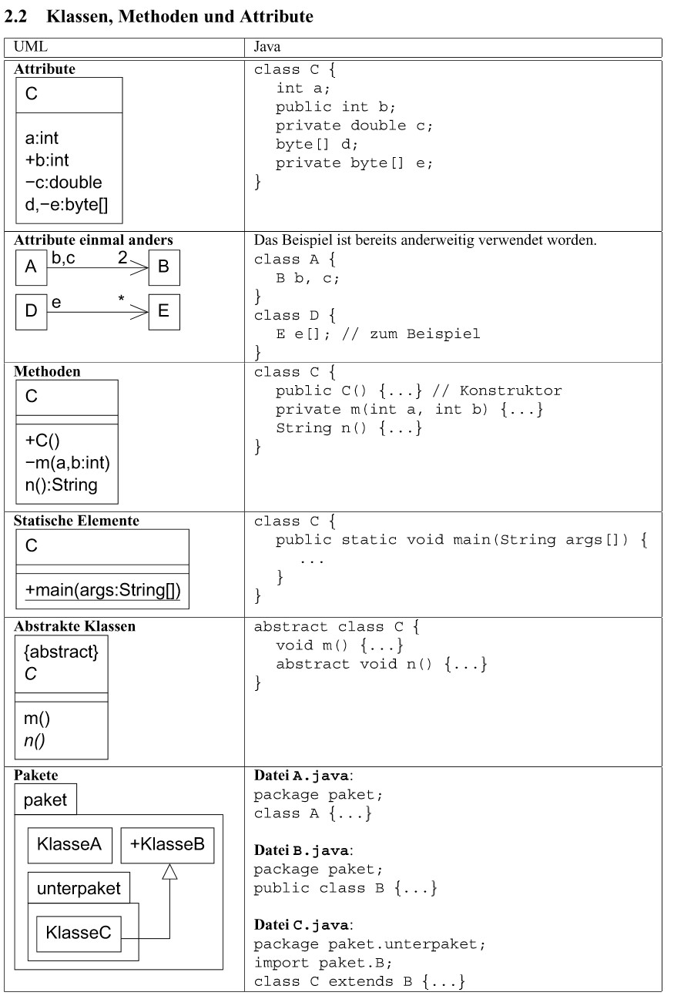
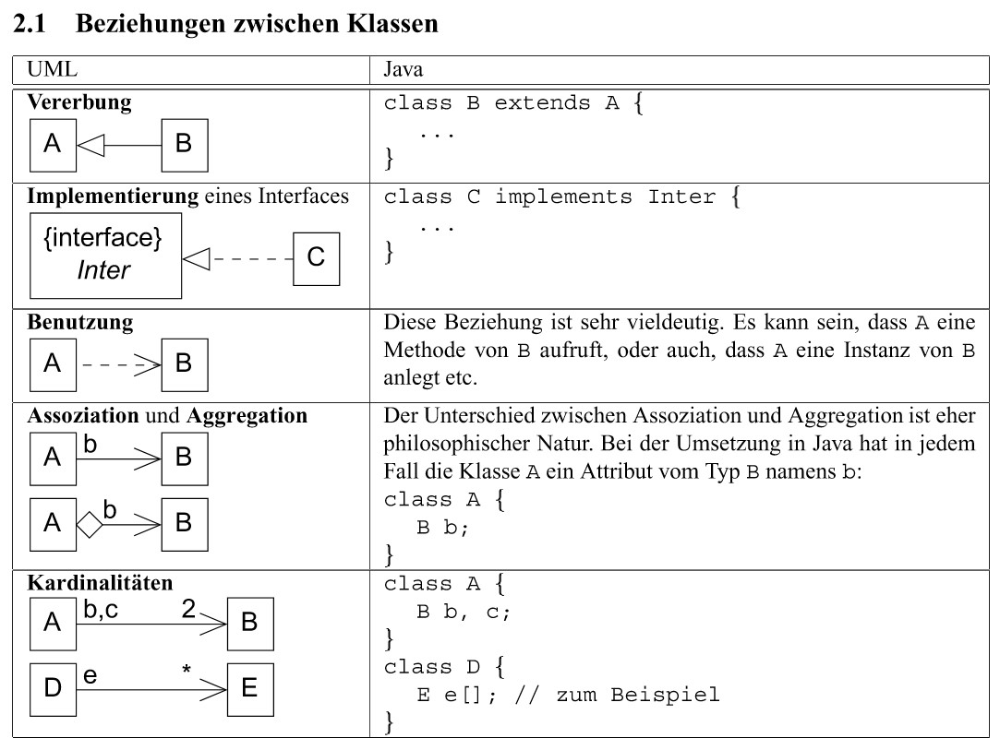

= Requirements

.Requirements
|===
|Name | Description | Prio

|Standalone
|
|high

|Klassendiagramm
|statisch
|high

|Anleitung
|statischer Text
|high

|Terminal
|Funktionaliät einer Main Methode
|high

|UML Parser
a|
Input 1..*  .java Files
wird dargestellt als UML

Attribute: visibility, name, type

Methods: visibility, name, input parameter, return

Beziehungen:

* extends, implements
* uses, assosiation/aggragation, cardinality (out of scope?)

|high

|showInstance();
a|[source,java]
----
Fahrzeug fahrzeug1  = new Fahrzeug("fahrzeug1", 22);
fahrzeug1.print();
>> Fahrzeug: fahrzeug1 fährt 22.0
----
|high

|showAvailableAttributes();
a|
----
public, private, protected
in Terminal or Visualisation?
----
|

|showAvailableMethods();
a|
----
public, private, protected
in Terminal or Visualisation?
----
|

|showReference();
a|
----
Fahrzeug fahrzeug1  = new Fahrzeug("fahrzeug1", 23);
Fahrzeug fahrzeug2 = fahrzeug1;
fahrzeug1.print(); >>Fahrzeug: fahrzeug1 fährt 23.0
fahrzeug2.print(); >>Fahrzeug: fahrzeug1 fährt 23.0

fahrzeug1.setName("fahrzeug1-remastered");
fahrzeug1.print();  >>Fahrzeug: fahrzeug1-remastered fährt 23.0
fahrzeug2.print();  >>Fahrzeug: fahrzeug1-remastered fährt 23.0
>> ? Point to copied class ?
----
|high

|showModifiability();
a|
----
>>final, static Variable
>>Fahrzeug.gravity = 1; >>compile error, no changes allowed
>>show similar to UML?

>>static Method call changes value in all instances
Fahrzeug fahrzeug1  = new Fahrzeug("fahrzeug1", 33);
Fahrzeug fahrzeug2  = new Fahrzeug("fahrzeug2", 44);

Fahrzeug.setDieselTax(10);
System.out.println(fahrzeug1.getDieselTax());  >>10.0
System.out.println(fahrzeug2.getDieselTax());  >>10.0
Fahrzeug.setDieselTax(20);
System.out.println(fahrzeug1.getDieselTax());  >>20.0
System.out.println(fahrzeug2.getDieselTax());  >>20.0
----
|high

|objectMethods();
a|
----
>>(==), equals(),
>> clone()  > shallow Copy, deep copy
----
|low

|methodExecuted();
a|
----
Fahrzeug fahrzeug  = new Fahrzeug("fahrzeug1", 50);
Auto auto          = new Auto("auto1", 20, 430, 2);
Cabriolet cabrio   = new Cabriolet("cabrio1", 20, 430, 2);

fahrzeug.print(); >>Fahrzeug: fahrzeug1 fährt 50.0
>> nearest method executed
auto.print();     >>Auto:     auto1 fährt 20.0
>> parent method used if no overwrite available
cabrio.print();  >>Auto:     auto1 fährt 20.0

>> ??? overwrite final Methods not possible out of scope?
----
|high

|methodsAvailable();
a|
----
Fahrzeug auto1   = new Auto("auto1", 66, 430, 2);
>>auto.getColor();  >> only methods declared in Reference class available

>> Casting in scope?
Auto auto2 = (Auto) auto1;
auto2.getColor();
>> instanceof in scope?
----
|high (without casting)

|isAlsoA();
a|
----
Fahrzeug fahrzeug  = new Fahrzeug("fahrzeug1", 0);
Fahrrad rad        = new Fahrrad("rad1", 48);
Auto auto          = new Auto("auto1", 20,430, 2);
Cabriolet cabrio   = new Cabriolet("cabrio1", 20,150, 4);

>> visualize or compile error enough?

>> assign to parent class ok .. is also a ...
fahrzeug = rad;
auto = cabrio;

>> assign to child, sibling class nok
>>rad = fahrzeug;
>>cabrio = auto;
>>rad = auto;
----
|low

|ReferenceVsObject();
a|
----
Fahrzeug f1 = new Fahrzeug("fahrzeug1", 0);
Auto a      = new Auto("auto1",20, 430, 2);
Fahrzeug f2  = new Auto("auto1",20, 430, 2);

>> f2 is reference of Fahrzeug  (Fahrzeug _ ) defines allowed methods
>> f2 is object of Auto (new ...) nearest method implementation used
processFahrzeug(f1);  >> Referenz Fahrzeug: Fahrzeug: fahrzeug1 fährt 0.0
processFahrzeug(a);   >> Referenz Auto:     Auto:     auto1 fährt 20.0
processFahrzeug(f2);  >> Referenz Fahrzeug: Auto:     auto1 fährt 20.0

>> in scope ?  > f2 is instance of Auto, Fahrzeug, Object
System.out.println(f2 instanceof Auto);      >>True
System.out.println(f2 instanceof Fahrzeug);  >>True
System.out.println(f2 instanceof Object);    >>True

System.out.println(f1 instanceof Auto);      >>False
----
|high

|abstactClass();
a|
----
>>instantiation not possible, visualize or compile error?
>>Item item = new Item();

>> abstract class as reference type, object Auto
Item item = new Auto("auto1",77, 430, 2);
item.print();  >>Auto:     auto1 fährt 20.0

>> method from abstract class can be executed
item.setWeight(10);
System.out.println(item.getWeight());  >>10.0
----
|high

|interfaces();
a|
----
>>method getPrice
Buyable fahrrad = new AntiqueBuyableFahrrad("rad1", 48,"Mittelalter",9999);

>>only getPrice() callable
fahrrad.getPrice();

>>visualize that Buyable interface
----
|high

|===