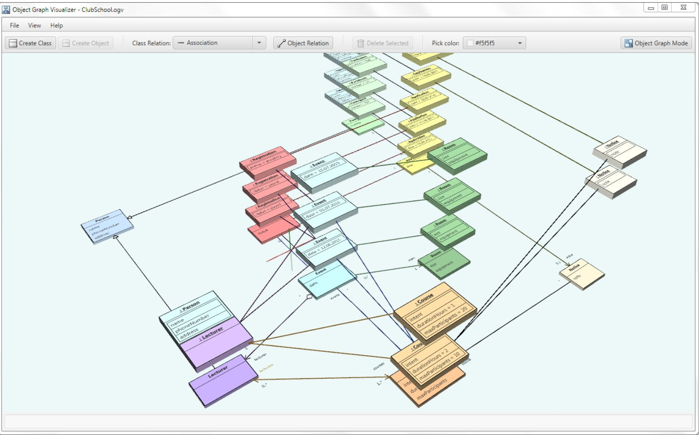
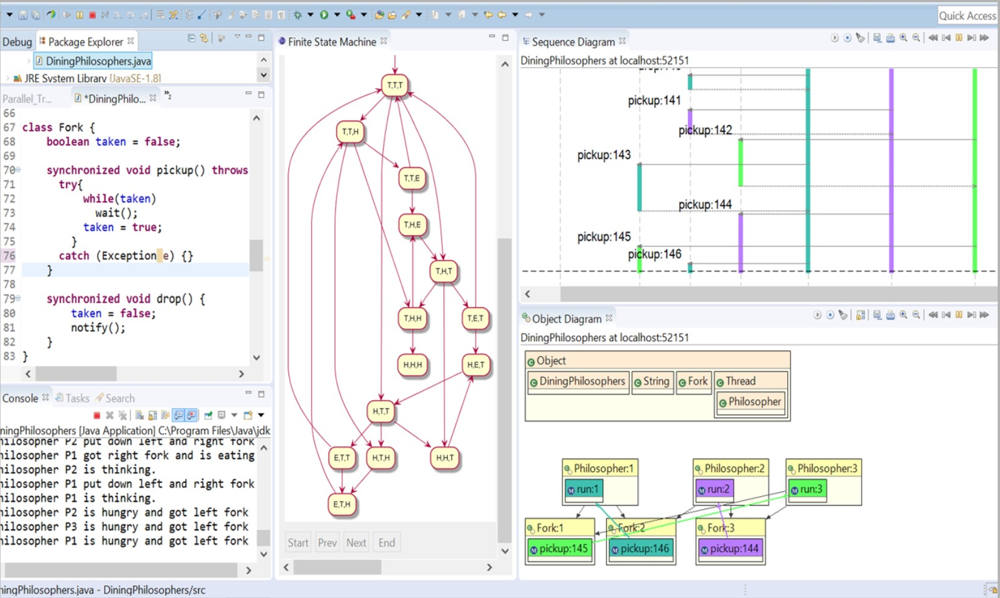
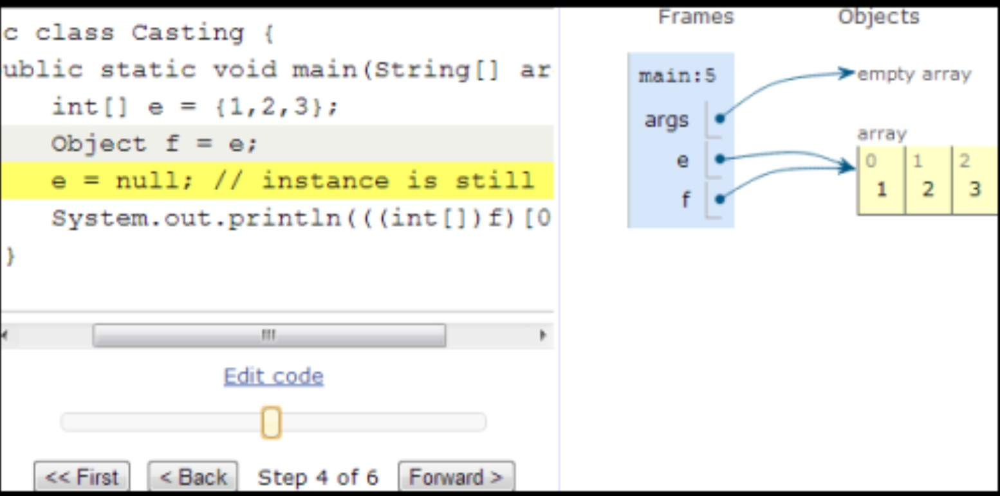
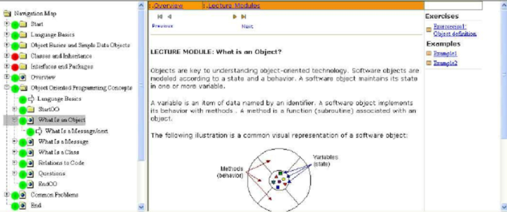
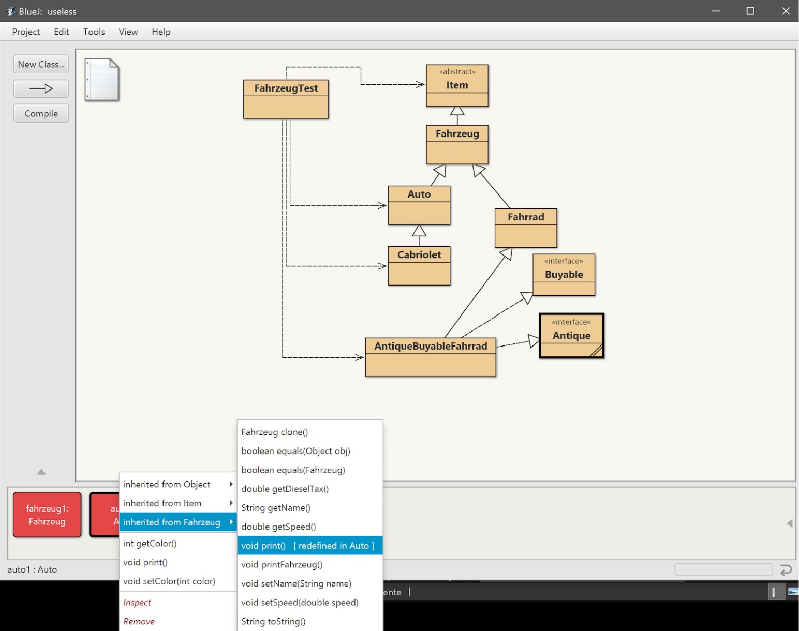

= Visualisation Instances in Java

=== Visualisierungstools für UML

https://www.ionos.com/digitalguide/websites/web-development/the-best-uml-tools/
    https://www.gliffy.com/
    http://argouml.tigris.org/

https://www.yworks.com/products/yed/gallery

=== Visualisierung von Instanzen
https://www.google.com/search?q=visualize+java+instance&rlz=1C1GCEA_enCH811CH811&source=lnms&tbm=isch&sa=X&ved=0ahUKEwim86OmrZXhAhUO2OAKHedSA_4Q_AUIDigB&biw=1160&bih=787

https://stackoverflow.com/questions/1824261/are-there-any-tools-to-visualize-the-objects-being-used-in-a-program

===  Visualisierung gesamtes Java Programm mit JavaFX
https://github.com/Nurtak/ObjectGraphVisualization
https://eprints.hsr.ch/459/

https://cse.buffalo.edu/jive/

https://daveagp.wordpress.com/2013/07/05/visualizing-java/

https://www.researchgate.net/figure/Visualization-of-the-navigation-graph-for-the-Java-e-lecture_fig1_220538122

=== Instanz als Kreis

=== Bluej

