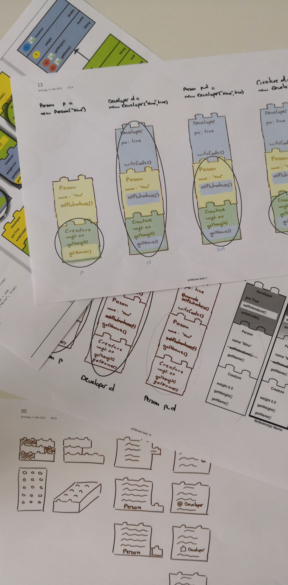

= Diskussion erste Skizzen

Besondere Schwierigkeiten für Studierende gemäss Interview:

* Objekt behält Eigenschaft (Infos sind nicht verloren), wenn Oberklasse zugewiesen
* Methoden nicht mehr aufrufbar, wenn Oberklasse zugewiesen
* Bei überschriebenen Methoden wird die Methode genommen, die zum Objekt passt.

Konzepte Vererbung gemäss Interview:

* Subklasse ist eine Spezialisierung, Umfang Funktionalität grösser
* Referenz bestimmt die Sicht (Metapher Pfeil, Brille, Fernrohr)

Mischen mit Farbe und Baustein eher unschön, jedoch soweit die beste Lösung
Gut: Kreis um die Legosteine: Referenz Objekt klar, explizit sichtbar

Zusätzlich, wichtig die Sicht zu vereinfachen: Methode und Attribute ausblenden

Darf so starten

Nächster Usability Test mit Studenten: Übung Musiker(Vorlesung 10) wird ausgiebig angeschaut
Start: 16:15

überschriebene Methode Darstellung?
Return oder print auf Konsole darstellen ok, Ausgeführte Methode highlight

