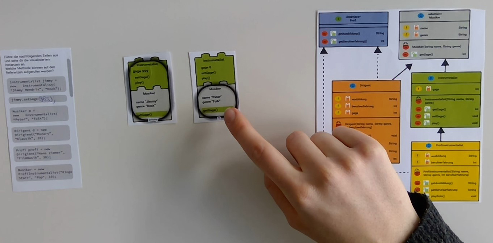

= Usablity Test Student

== Test Objekt
Ausgedruckter HiFi Prototyp. Aufgabe ist, die Codezeilen auszuführen und die erstellten
Instanzen zu beschreiben.
Das verwendete Klassendiagramm wurde von den Studierenden in der
vorhergehen Lektion soeben in einer Übung verwendet.

Ziel: Prüfen ob die einzelnen Teile der Darstellung und die Gesamtübersicht klar sind und
dabei möglichst viele Fehler und Unklarheiten in der Darstellung ausfindig machen.

.FindingsStudent1
|===
| Typ Idee, Problem, Lob | Beobachtung | Handlungsempfehlung

|Lob
| 0:50 Klassendiagramm ist übersichtlich
|

|Lob
|1:58 Symbol m = Method, Schloss = private klar
|

|Problem
|2:10 Symbol f = field (attribut), C = Class (Klasse), C + Helm
|3:00 Variante 1: Mit Hover Erklärungen zu den Abkürzungen zeigen
Variante 2: Abkürzungen auch in Deutsch anbieten

|Problem
|4:20 Kreis für Referenz verwirrend, sieht aus wie ein Tank
|Kreis für Referenz evtl. gestalterisch ansprechender gestalten

|Lob
|4:30 Farblich gekennzeichnete Klasse hilft zur Orientierung
|

|Lob
|4:40 Klar, dass es sich um Bauklötze handelt
|

|Lob
|5:10 Verdrehte Reihenfolge der Legos, macht selbsterklärend Sinn,
Kindklasse baut auf Elternklasse auf.
|

|Lob
|6:25, 7:25 Überschriebene Methode wird durch farbliche Kennzeichnung klar
|

|Lob
| 10:35 Es wird klar, dass aufgrund des Kreises die Sicht gemeint ist, dass man
nur die Informationen im Kreis benutzen kann.
|

|Idee
|14:00 Es wäre schöner, wenn man die Kötze klarer trennt, z.B. mit einem
weissen Abstand dazwischen.
|Abstände zwischen den Legosteine klarer darstellen,
z.B. mit zusätzlicher weisser Linie dazwischen

|Idee
| Musiker m statt nur m schreiben
| Referenz Typen zusätzlich neben dem Referenz Namen anzeigen, z.B. "Musiker m"

> Alternativ wird der Referenzname oben am Referenzkreis angezeigt, gleich
neben dem Klassennamen, welcher mit dem Referenztypen übereinstimmt.

|Lob
|15:35 Visualisierung hilfreich zum Lernen
|

|Idee
|16:10 Mehr explizite Informationen. Insbesondere Musiker m statt nur m schreiben.
Und den Kreis Kennzeichnen
|Weitere Kontext Informationen explizit zeigen. z.B. bei Hover auf Referenz
"Referenz = definiert die Sicht, bearbeitbarer Bereich"

|===

.FindingsStudent2
|===
| Typ Idee, Problem, Lob | Beobachtung | Handlungsempfehlung

|Lob
|0:30 Icons "Konstruktor", "private", "m","c"   klar
|

|Problem
|2:20 Icon f nicht klar. User erwartet, a=attribut oder v=variable
|Attribut Icon im "a" darstellen.

|Lob
|4:15 Klar, dass es sich um einen Baustein handelt
|

|Lob
|4:40 Farbliche Hervorhebung der Klassen und farblicher Zusammenhang
in der Instanz der hilfreich.
|

|Lob
|5:15, 10:30 Ausgeführte Methode wird durch farbliche Hervorhebung klar.
|

|Lob
|6:30 "Umgedrehte" Reihenfolge Bausteine passt.
|

|Lob
|7:44 Kreis definiert den Fokus klar. Visualisierung ausführbare Methoden
gut.
|

|Lob
|9:35 Interface wird klar durch gestrichelten Rahmen.
|

|Lob
|10:00 Grössere Bausteine sind in Ordnung, Infos bleiben übersichtlich.
|

|Lob
|12:15 Generell sehr hilfreiche die Darstellung.
|

|===

.FindingsStudent3
|===
| Typ Idee, Problem, Lob | Beobachtung | Handlungsempfehlung

|Problem
|2:20 Icon f nicht klar.
|

|Lob
|3:05 Baustein ist klar. Grundbaustein: Die Reihenfolge der Bausteine passt.
|

|Idee
|3:55 "Eigentlich wäre der unterste Baustein "Object""
|Object Klasse fakultativ auch darstellen.

|Lob
|5:00 Kreis als Referenz wird klar.
|

|Lob
|6:40 Darstellung Interface gestrichelt wird klar.
|

|9:15 Kreis als Referenz bei Ansicht eines Objektes nicht sofort klar,
wenn man aber zwei Unterschiedliche Objekte neben einander hat, wird
die Bedeutung des Kreises klar.
|

|===